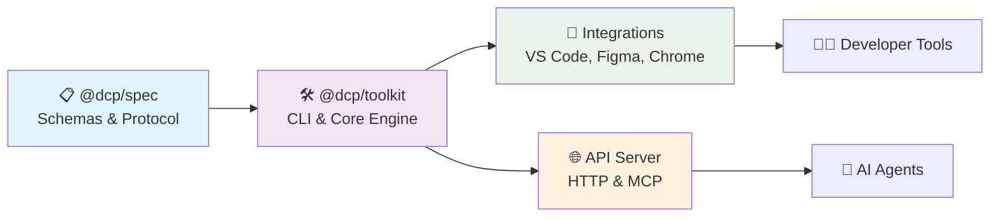

# 📂 DCP Repository Index

> **Design Component Protocol** - Hybrid workspace with contract specification and reference implementation

## 🏗️ Repository Structure

<details>
<summary>📁 <strong>Workspace Tree</strong> (click to expand)</summary>

```
dcp-workspace/
├── packages/
│   ├── dcp-spec/           # 📋 Contract & Schemas
│   └── dcp-toolkit/        # 🛠️ Implementation & Tools
├── .github/workflows/      # 🚀 CI/CD Pipelines
│   ├── spec-validation.yml # Schema validation & version enforcement
│   └── toolkit-tests.yml  # Tests, CLI validation & coverage
├── REPO_INDEX.md          # 📑 This file
├── README.md              # 🏠 Project overview
├── CHANGELOG.md           # 📝 Version history
└── package.json           # 📦 Workspace config
```

</details>

## 🔄 Architecture Flow



---

## 📋 @dcp/spec Package

> **Pure contract definition** - JSON schemas, OpenAPI spec, and protocol definitions

```
packages/dcp-spec/
├── schemas/               # JSON Schema definitions
│   ├── dcp.component.schema.json    # Core component schema
│   ├── config.schema.json           # Configuration schema
│   ├── manifest.schema.json         # Registry manifest schema
│   └── theme.schema.json            # Design token schema
├── openapi/              # API specifications
│   └── dcp-api.yaml      # REST API definition
├── mcp/                  # Model Context Protocol
│   └── manifest.json     # MCP server manifest
├── scripts/              # Validation & build scripts
│   └── validate-schemas.js
├── index.js              # Package exports
└── package.json          # Spec package config
```

**Key Exports:**
- `componentSchema` - Validates component definitions
- `configSchema` - Validates project configuration
- `manifestSchema` - Validates registry structure
- `themeSchema` - Validates design tokens
- `DCP_VERSION` - Current protocol version

---

## 🛠️ @dcp/toolkit Package

> **Reference implementation** - CLI tools, API server, integrations, and development resources

### 🎯 Core Implementation

```
packages/dcp-toolkit/
├── bin/                   # 🖥️ CLI Executables
│   ├── dcp.js            # Main CLI interface
│   ├── dcp-transformer.js # Legacy transformer (deprecated)
│   └── index.js          # Programmatic API
├── src/                   # 📁 Source Code
│   ├── commands/         # CLI command implementations
│   ├── core/            # Core business logic
│   ├── adaptors/        # Framework-specific extractors
│   ├── lib/             # Shared utilities
│   ├── api-server.js    # HTTP API server
│   ├── mcp-server.js    # MCP integration
│   └── mcp-server-http.js # HTTP MCP bridge
```

### 📚 CLI Commands

| Command | Purpose | Example |
|---------|---------|---------|
| `extract` | Extract components from source | `dcp extract ./src --out ./registry` |
| `validate` | Validate registry against schema | `dcp validate ./registry.json` |
| `mutate` | Apply JSON Patch mutations | `dcp mutate registry.json patch.json output.json` |
| `serve` | Start development server | `dcp serve ./registry --port 3000` |
| `watch` | Live registry updates | `dcp watch ./src --out ./registry` |
| `agent` | AI-powered mutations | `dcp agent "Make all buttons accessible"` |
| `transpile` | Convert to target framework | `dcp transpile registry.json --target react` |
| `query` | Search components | `dcp query "Button[variant=primary]"` |

### 🔌 Integrations

```
packages/dcp-toolkit/integrations/
├── chrome-extension/      # 🌐 Browser DevTools (beta)
│   ├── manifest.json     # Extension config
│   ├── background.js     # Service worker
│   ├── content.js        # Page injection
│   └── sidepanel.html    # UI interface
├── figma-dcp/            # 🎨 Figma Plugin (public beta)
│   ├── manifest.json     # Plugin config
│   ├── code.ts          # Plugin logic
│   └── ui.html          # Plugin interface
└── vscode-dcp/           # 📝 VS Code Extension (stable)
    ├── package.json      # Extension config
    ├── src/extension.ts  # Main extension
    ├── src/completionProvider.ts  # IntelliSense
    └── src/diagnosticsProvider.ts # Error checking
```

**Integration Status:**
- 🟢 **VS Code Extension**: Stable - IntelliSense, validation, auto-completion
- 🟡 **Figma Plugin**: Public beta - Token sync, component export
- 🟡 **Chrome Extension**: Beta - Component inspection, live editing

### 📖 Documentation

```
packages/dcp-toolkit/docs/
├── api/                  # 🌐 API Documentation
│   └── mcp-integration.md # MCP server guide
├── development/          # 👨‍💻 Developer Guides
│   ├── contributing.md   # Contribution guide
│   ├── adaptors/        # Framework adaptor docs
│   ├── tsdoc.md         # Documentation standards
│   └── claude-guide.md  # AI development guidance (CLAUDE.md)
├── examples/            # 💡 Usage Examples
│   ├── configs/         # Configuration examples
│   ├── roster/          # Complete app example
│   └── sds-figma/       # Design system integration
└── guides/              # 📋 User Guides
    └── agent-guide.md   # AI agent usage
```

### 🧪 Testing & Development

```
packages/dcp-toolkit/
├── tests/               # 🧪 Test Suite
│   ├── unit/           # Unit tests
│   ├── integration/    # Integration tests
│   └── fixtures/       # Test data
├── templates/          # 🏗️ Project Templates
├── scripts/           # 🔧 Build Scripts
├── registry/          # 📊 Test Registry
├── views/             # 🖼️ UI Templates
└── jest.config.js     # Test configuration
```

---

## 🚀 CI/CD Pipelines

```
.github/workflows/
├── spec-validation.yml    # Validates JSON schemas & package exports
└── toolkit-tests.yml     # Runs toolkit tests & CLI validation
```

**Automated Checks:**
- ✅ Schema validation and package exports ([spec-validation.yml](.github/workflows/spec-validation.yml))
- ✅ Version bump enforcement on spec changes
- ✅ Multi-Node.js version testing (18, 20) ([toolkit-tests.yml](.github/workflows/toolkit-tests.yml))
- ✅ CLI functionality verification
- ✅ Code coverage reporting

---

## 🎯 Quick Start Guide

### 1. **Install Toolkit**
```bash
npm install -g @dcp/toolkit
```

### 2. **Extract Components**
```bash
dcp extract ./src/components --out ./design-system
```

### 3. **Start API Server**
```bash
dcp api --port 3000
```

### 4. **Use with MCP (Claude/AI)**
```bash
dcp-mcp --stdio
```

### 5. **Development Workflow**
```bash
# Watch for changes
dcp watch ./src --out ./registry

# Validate registry
dcp validate ./registry

# Apply mutations
dcp agent "Add dark mode support to all components"
```

---

## 📦 Package Management

### **Workspace Scripts**
```bash
npm test                    # Run toolkit tests
npm run lint:spec          # Validate spec package
npm run build              # Build all packages
npm run serve              # Start development server
```

### **Individual Packages**
```bash
# Work with specific packages
npm run test --workspace @dcp/toolkit
npm run lint --workspace @dcp/spec
```

---

## 🔗 Key Files Reference

| File | Purpose | Package |
|------|---------|---------|
| `dcp.component.schema.json` | Component validation schema | @dcp/spec |
| `bin/dcp.js` | Main CLI entry point | @dcp/toolkit |
| `src/core/parser.js` | Component extraction engine | @dcp/toolkit |
| `src/commands/agent.js` | AI mutation engine | @dcp/toolkit |
| `integrations/vscode-dcp/` | VS Code extension | @dcp/toolkit |
| `docs/examples/roster/` | Complete app example | @dcp/toolkit |
| `CLAUDE.md` | AI development guidance | Workspace root |

---

## 🏷️ Version Information

- **Protocol Version**: Defined in `@dcp/spec`
- **Implementation Version**: Defined in `@dcp/toolkit`
- **Workspace Version**: Defined in root `package.json`

---

## 📞 Development Resources

- **Issues**: [GitHub Issues](https://github.com/stevewitmer/dcp-transformer/issues)
- **Discussions**: [GitHub Discussions](https://github.com/stevewitmer/dcp-transformer/discussions)
- **Contributing**: `packages/dcp-toolkit/docs/development/contributing.md`
- **API Docs**: Start server with `dcp api` and visit `/docs`

---

*Last Updated: 2025-07-24 22:50:48
*Repository: DCP Transformer v2.0 - Hybrid Workspace Architecture*