# DCP API Quick Start

The DCP Platform API transforms design system management from a CLI tool into a comprehensive HTTP platform for teams, tools, and AI agents.

## 🚀 Quick Start

### Local Development

```bash
# 1. Install DCP
npm install -g dcp-transformer

# 2. Extract your design system (creates ./registry directory)
dcp extract ./src --out ./registry

# 3. Start the API server
dcp api --port 7401 --registry ./registry

# 4. Test the API
curl http://localhost:7401/api/v1/health
```

### Extract → Serve Workflow

The DCP platform follows a simple **Extract → Serve** pattern:

```mermaid
flowchart LR
    A[📁 Source Code<br/>./src] --> B[🔍 dcp extract]
    B --> C[📦 Registry<br/>./registry/]
    C --> D[🚀 dcp api]
    D --> E[🌐 REST API<br/>localhost:7401]
    
    C --> C1[registry.json<br/>📄 Main registry]
    C --> C2[components/<br/>📦 Individual .dcp.json files]
    C --> C3[tokens/<br/>🎨 Token category files]
    C --> C4[metadata.json<br/>📊 Project intelligence]
```



**Step 1: Extract** - Scan your codebase and generate a structured registry
**Step 2: Serve** - Expose the registry via REST API with validation, querying, and mutation capabilities

Your API is now running at:
- **API**: http://localhost:7401/api/v1
- **Docs**: http://localhost:7401/docs
- **Health**: http://localhost:7401/api/v1/health

### Cloud Deployment (Vercel)

```bash
# 1. Deploy to Vercel
vercel --env DCP_REGISTRY_PATH=./registry --env DCP_JWT_SECRET=your-secret

# 2. Your API will be available at:
# https://your-app.vercel.app/api/v1
```

## 📖 Example Usage

### Validate Code Against Design System

```typescript
const response = await fetch('http://localhost:7401/api/v1/validate', {
  method: 'POST',
  headers: { 'Content-Type': 'application/json' },
  body: JSON.stringify({
    code: `<Button variant="invalid" size="xl">Click me</Button>`,
    filePath: 'src/components/MyComponent.tsx'
  })
});

const result = await response.json();
console.log(result.valid); // false
console.log(result.errors); // [{ message: "Invalid variant 'invalid'...", line: 1 }]
```

### Query Components and Tokens

```typescript
// Find all input components with variants
const components = await fetch('http://localhost:7401/api/v1/query', {
  method: 'POST',
  headers: { 'Content-Type': 'application/json' },
  body: JSON.stringify({
    selector: 'components[category=inputs][props.variant]'
  })
});

// Get color tokens as CSS variables
const tokens = await fetch('http://localhost:7401/api/v1/registry/tokens/color?format=css');
console.log(await tokens.text());
// --color-primary-500: #3b82f6;
// --color-primary-600: #2563eb;
```

### Browse Components with Pagination

```typescript
const response = await fetch('http://localhost:7401/api/v1/registry/components?page=1&limit=10&search=button');
const data = await response.json();

console.log(`Found ${data.pagination.total} components`);
data.components.forEach(comp => {
  console.log(`${comp.name}: ${comp.description}`);
});
```

## 🔐 Authentication

For write operations, include a JWT token:

```typescript
const response = await fetch('http://localhost:7401/api/v1/analyze', {
  method: 'POST',
  headers: {
    'Content-Type': 'application/json',
    'Authorization': 'Bearer your-jwt-token'
  },
  body: JSON.stringify({ source: './src' })
});
```

### Generate JWT Token (Development)

```javascript
import jwt from 'jsonwebtoken';

const token = jwt.sign(
  { 
    userId: 'dev-user',
    role: 'contributor',  // viewer, contributor, admin
    exp: Math.floor(Date.now() / 1000) + (60 * 60 * 24) // 24 hours
  },
  'your-jwt-secret'
);

console.log('Bearer', token);
```

## 🔧 Advanced Examples

### CI/CD Validation Pipeline

```yaml
# .github/workflows/design-system.yml
- name: Validate Design System Compliance
  run: |
    # Extract current registry
    npx dcp extract ./src --json > current-registry.json
    
    # Start API server
    npx dcp api --registry ./ &
    sleep 3
    
    # Validate changed files
    git diff --name-only HEAD~1 HEAD -- '*.tsx' | while read file; do
      curl -X POST http://localhost:7401/api/v1/validate \
        -H "Content-Type: application/json" \
        -d "{\"code\": \"$(cat $file | jq -Rs .)\", \"filePath\": \"$file\"}" \
        --fail-with-body
    done
```

### VS Code Extension Integration

```typescript
// extension.ts
const validateCurrentFile = async () => {
  const document = vscode.window.activeTextEditor?.document;
  if (!document) return;
  
  const response = await fetch('http://localhost:7401/api/v1/validate', {
    method: 'POST',
    headers: { 'Content-Type': 'application/json' },
    body: JSON.stringify({
      code: document.getText(),
      filePath: document.fileName
    })
  });
  
  const result = await response.json();
  
  // Show diagnostics in VS Code
  const diagnostics = result.errors.map(error => 
    new vscode.Diagnostic(
      new vscode.Range(error.line - 1, error.column - 1, error.line - 1, error.column),
      error.message,
      vscode.DiagnosticSeverity.Error
    )
  );
  
  diagnosticCollection.set(document.uri, diagnostics);
};
```

### Figma Plugin Sync

```typescript
// figma-plugin.ts
const syncWithDCP = async () => {
  // Get design tokens from Figma
  const tokens = extractTokensFromFigma();
  
  // Validate against DCP registry
  const response = await fetch('https://api.dcp.dev/v1/registry/tokens');
  const dcpTokens = await response.json();
  
  // Find missing or mismatched tokens
  const issues = compareTokens(tokens, dcpTokens.tokens);
  
  figma.notify(`Found ${issues.length} token inconsistencies`);
};
```

## 📊 Analytics & Monitoring

### Usage Analytics

```typescript
const analytics = await fetch('http://localhost:7401/api/v1/analytics/usage');
const data = await analytics.json();

console.log(`Total components: ${data.components.total}`);
console.log(`Component categories:`, data.components.categories);
console.log(`Complexity distribution:`, data.components.complexity);
```

### Project Analysis

```typescript
const analysis = await fetch('http://localhost:7401/api/v1/analyze', {
  method: 'POST',
  headers: { 
    'Content-Type': 'application/json',
    'Authorization': 'Bearer your-token'
  },
  body: JSON.stringify({
    source: './src',
    includeDependencies: true
  })
});

const result = await analysis.json();
console.log('Project intelligence:', result.intelligence);
console.log('Dependencies:', result.dependencies);
```

## 🔗 Integration Examples

### Next.js API Route

```typescript
// pages/api/design-system/validate.ts
export default async function handler(req: NextApiRequest, res: NextApiResponse) {
  const { code, filePath } = req.body;
  
  const response = await fetch(`${process.env.DCP_API_URL}/validate`, {
    method: 'POST',
    headers: { 'Content-Type': 'application/json' },
    body: JSON.stringify({ code, filePath })
  });
  
  const result = await response.json();
  res.status(200).json(result);
}
```

### Express.js Middleware

```typescript
import { validateDesignSystem } from './dcp-middleware';

app.use('/api/components', validateDesignSystem({
  dcpApiUrl: 'http://localhost:7401/api/v1',
  failOnErrors: true
}));
```

### React Hook

```typescript
import { useDCPValidation } from './hooks/useDCPValidation';

const ComponentEditor = () => {
  const { validate, isValidating, errors } = useDCPValidation({
    apiUrl: 'http://localhost:7401/api/v1'
  });
  
  const handleCodeChange = (code: string) => {
    validate(code, 'editor.tsx');
  };
  
  return (
    <div>
      <CodeEditor onChange={handleCodeChange} />
      {errors.map(error => (
        <ErrorMessage key={error.line} error={error} />
      ))}
    </div>
  );
};
```

## 🚀 Deployment Options

### Docker

```dockerfile
FROM node:20-alpine
WORKDIR /app
COPY package*.json ./
RUN npm ci --only=production
COPY . .
EXPOSE 7401
CMD ["npx", "dcp", "api", "--port", "7401", "--registry", "./registry"]
```

### Kubernetes

```yaml
apiVersion: apps/v1
kind: Deployment
metadata:
  name: dcp-api
spec:
  replicas: 3
  selector:
    matchLabels:
      app: dcp-api
  template:
    metadata:
      labels:
        app: dcp-api
    spec:
      containers:
      - name: dcp-api
        image: your-registry/dcp-api:latest
        ports:
        - containerPort: 7401
        env:
        - name: DCP_JWT_SECRET
          valueFrom:
            secretKeyRef:
              name: dcp-secrets
              key: jwt-secret
        - name: DCP_REGISTRY_PATH
          value: "/app/registry"
```

### Serverless (Vercel/Netlify)

```javascript
// api/health.js
export default async function handler(req, res) {
  res.status(200).json({ 
    status: 'healthy',
    version: '2.0.0',
    timestamp: new Date().toISOString()
  });
}
```

## 📚 Resources

- **API Documentation**: http://localhost:7401/docs
- **OpenAPI Spec**: [src/api/openapi.js](../src/api/openapi.js)
- **TypeScript SDK**: Coming soon
- **VS Code Extension**: Coming soon
- **GitHub Actions**: [.github/workflows/](../../../.github/workflows/)

## 🔧 Configuration

### Environment Variables

```bash
# API Configuration
DCP_API_PORT=7401
DCP_API_HOST=localhost
DCP_REGISTRY_PATH=./registry

# Security
DCP_JWT_SECRET=your-secret-key
DCP_RATE_LIMIT_MAX=1000
DCP_RATE_LIMIT_WINDOW=900000  # 15 minutes

# Environment
NODE_ENV=production
DCP_ENVIRONMENT=production
```

### Registry Hot Reload

The API server automatically detects changes to the registry and reloads:

```bash
# In one terminal
dcp api --registry ./registry --verbose

# In another terminal  
dcp extract ./src --out ./registry  # API will reload automatically
```

## 🛠️ Troubleshooting

### Common Issues and Solutions

**❌ "Registry not found at ./registry"**
```bash
# Solution: Extract your components first
dcp extract ./src --out ./registry

# Or specify existing registry path
dcp api --registry /path/to/existing/registry
```

**❌ "ENOENT: no such file or directory, open './registry/registry.json'"**
```bash
# The registry directory exists but is missing the main registry file
dcp extract ./src --out ./registry  # Re-extract to create all files
```

**❌ API returns "status": "degraded" in /health endpoint**
```bash
# Check registry loading
curl http://localhost:7401/api/v1/health | jq '.registry'

# Fix: Re-extract if registry is corrupted
dcp extract ./src --out ./registry
```

**❌ Empty components or tokens in API responses**
```bash
# Verify extraction worked
ls -la ./registry/
# Should see: registry.json, components/, tokens/, metadata.json

# Re-extract with verbose output
dcp extract ./src --out ./registry --verbose
```

**❌ Hot-reload not working**
```bash
# Ensure you're running with verbose flag
dcp api --registry ./registry --verbose

# Watch for "📁 Registry file changed" messages when you re-extract
```

### Development Workflow

```bash
# 1. Initial setup
dcp extract ./src --out ./registry
dcp api --registry ./registry --verbose

# 2. Make code changes to your components
# ... edit files in ./src ...

# 3. Re-extract (API will auto-reload)
dcp extract ./src --out ./registry

# 4. Verify changes via API
curl http://localhost:7401/api/v1/health
curl http://localhost:7401/api/v1/registry/components
```

## 🎯 Next Steps

1. **Generate TypeScript SDK**: `npx openapi-generator-cli generate -i src/api/openapi.js -g typescript-fetch`
2. **Set up CI/CD**: Use the provided GitHub Actions workflow
3. **Build VS Code Extension**: Use the validation endpoint for real-time linting
4. **Create Figma Plugin**: Sync design tokens between Figma and code
5. **Deploy to Production**: Use Docker, Vercel, or your preferred platform

The DCP API turns your design system into a **living, queryable, validatable platform** that integrates with any tool or workflow! 🚀