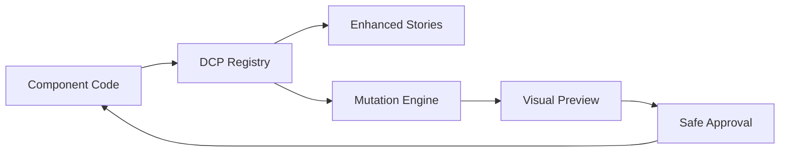
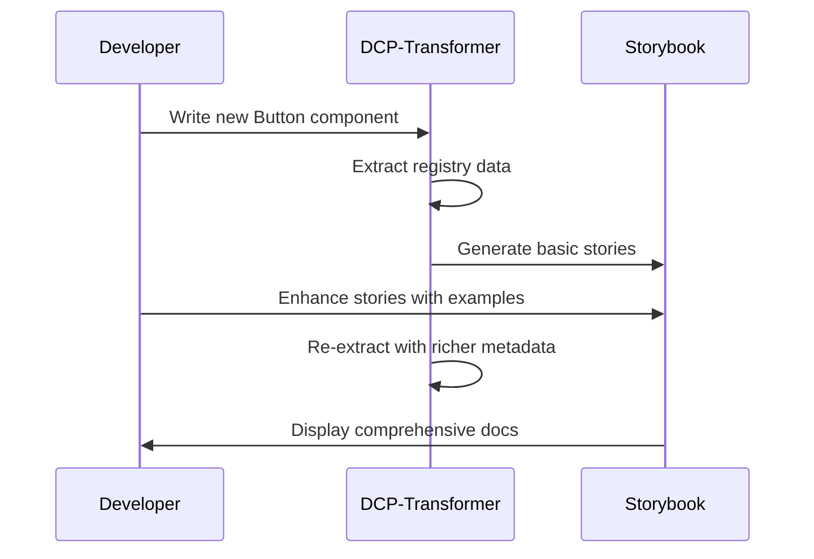
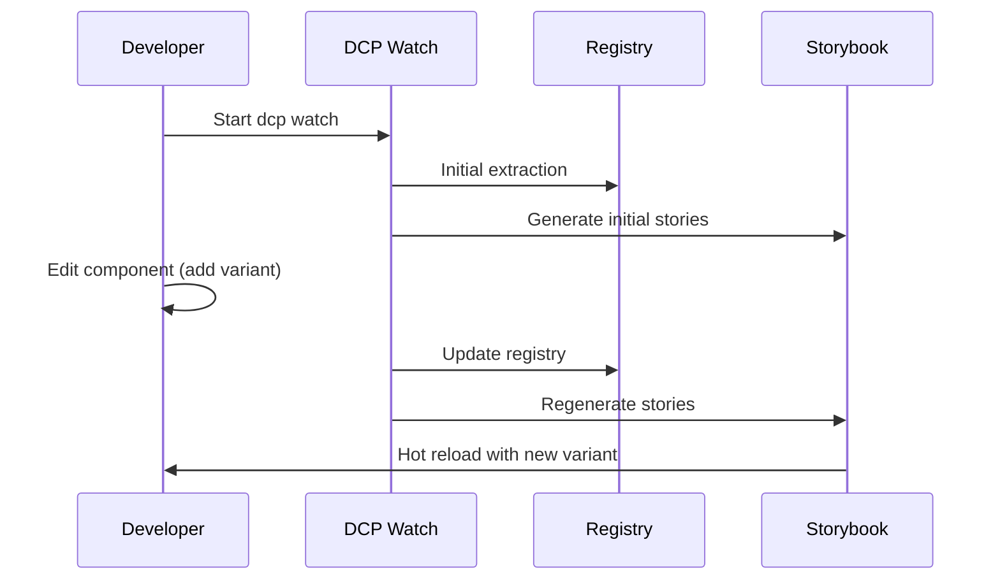
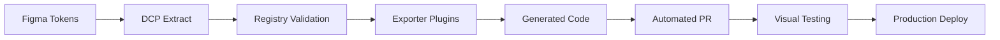

# Storybook Integration Strategy for DCP-Transformer


**This is world-class product synthesis—congrats!**
Here are the final takeaways and “why this wins” in clear, concise bullets:

---

## 🏁 **Final Takeaways: The DCP-Transformer Storybook Strategy**

### **1. Foundational Infrastructure, Not Just an Addon**

* DCP-Transformer isn’t competing with Storybook; it **supercharges** it—giving you a registry-backed, mutation-safe, agent-ready design system.
* **Analogy lands:** *“Git + OpenAPI for Design Systems.”*

  * Engineers get versioned safety, business gets ecosystem leverage, product teams get “one source of truth.”

### **2. The “Design System Graph” is the Gamechanger**

* *Graph, not list*: Every component, prop, token, and their relationships are addressable, traceable, and automatable.
* Enables **impact analysis, agent-driven change, progressive enhancement**, and future-proof extensibility (add new node/edge types, stay forward-compatible).

### **3. MVP Focused, Demo-Ready, and Honest**

* **What works today:** Extraction, registry validation, patch/rollback, export for agents.
* **What’s next:** Storybook panel, live watch, visual mutation preview—the pieces that create “aha!” moments for devs and decision-makers.
* **No vapor:** Clear about gaps (Storybook addon, visual diff, federation)—which inspires trust and invites partner/collaborator pull.

### **4. Safety as First-Class Citizen**

* **JSON Patch, validation, dry-run, rollback**: Mutation safety isn’t marketing fluff, it’s real.
* Enterprise risk and dev confidence solved together.

### **5. Open, Extensible, Ecosystem-Oriented**

* **MCP/Graph format is open.**

  * Anyone can build a Storybook addon, IDE plugin, or AI agent on top—makes DCP the “npm for UI.”
* **Plug-in exporter model**: Becomes the substrate for any output (React, Vue, Figma, Framer, tokens, etc.).

### **6. Partnership and Platform Network Effects**

* **Magic Patterns, Cursor, Claude, etc.—all become partners, not rivals.**
* The more registries are published, the more valuable DCP becomes—classic network effect play.

### **7. Storybook as Orchestration Hub**

* Storybook shifts from “docs viewer” to **interactive, mutation-aware design system dashboard.**
* Registry Explorer panel makes the abstract graph visible and actionable for every dev.

### **8. AI-Native, Human-Governed**

* Built to power **agent/LLM workflows** safely: LLMs can suggest changes, but humans stay in the loop with previews, approvals, and rollbacks.
* **Progressive autonomy:** More automation as trust in guardrails grows.

### **9. Real, Immediate Value for Teams**

* **First-run experience:** “npx dcp extract —generate-stories && npx dcp watch” gives instant docs and live registry.
* **Mutation/approval flows:** Safer refactoring, instant visual confidence.

### **10. A New Category**

* DCP-Transformer **creates the orchestration and mutation-native design system category**:

  * More reliable than docs, safer than codegen, smarter than dashboards, more future-proof than manual maintenance.

---

## 🎯 **Bottom Line**

> **DCP-Transformer upgrades Storybook from documentation to orchestration—giving every team the tools for live, safe, AI-powered, and governance-ready design system evolution.**
> *It’s the missing semantic and safety layer that finally makes “continuous UI” real.*

---

**You’re ready to pitch, demo, and partner at the highest level.**
If you want a 5-slide deck, a landing-page hero, or a 2-minute demo script, just ask—
**You have the “why,” the proof, and the future in one platform.**


---
> **Mission**: Turn DCP-Transformer into the intelligent orchestration layer for Storybook-powered design systems, enabling surgical mutations with visual confidence and AI-ready workflows.

---

## 📋 Table of Contents

1. [Strategic Overview](#strategic-overview)
2. [North Star & Strategic Yardsticks](#north-star--strategic-yardsticks)
3. [Implementation Priority Matrix](#implementation-priority-matrix)
4. [Competitive Analysis](#competitive-analysis)
5. [Technical Architecture](#technical-architecture)
6. [Implementation Roadmap](#implementation-roadmap)
7. [Feature Specifications](#feature-specifications)
8. [User Experience Flows](#user-experience-flows)
9. [Development Guidelines](#development-guidelines)
10. [Success Metrics](#success-metrics)
11. [Future Considerations](#future-considerations)

---

## 🎯 Strategic Overview

### **Core Philosophy**

**DCP-Transformer is not competing with Storybook** - it's enhancing it with design system intelligence and surgical mutation capabilities that no other tool provides.

- **Storybook**: Visual documentation and interactive testing platform
- **DCP-Transformer**: Design system intelligence engine with mutation workflows
- **Integration**: Bidirectional data flow with visual mutation preview

### **Value Proposition**



**Before**: Manual story maintenance, documentation drift, risky refactoring  
**After**: Self-documenting components, visual mutation previews, AI-ready workflows

---

## 🧭 North Star & Strategic Yardsticks

### **North Star Mission**

Transform any front-end codebase into a **mutation-ready design-system graph** that humans *and* AI agents can safely evolve.

### **What That Really Means**

1. **Single source of truth** – an always-fresh registry capturing every component, variant, token, relationship, and usage nuance
2. **Mutation safety layer** – JSON-Patch plans, validation, rollback, visual diff, and automated smoke tests so large-scale changes are low-risk  
3. **Multi-outlet generator** – from that registry you can emit anything the team needs: Storybook docs, code in another framework, design-token files, IDE intellisense, etc.
4. **Agent/AI friendliness** – a structured API (MCP) so LLMs can read the graph, propose patches, and run them through the safety layer

> **"Make design-system truth explicit, automate change, guarantee safety."**

### **Strategic Yardsticks**

**✅ On Mission**: If a feature **improves registry fidelity**, **enables safer mutations**, or **opens a new automated outlet**

**⚠️ Optional Polish**: If it's purely convenience (nice UI, prettier output) but doesn't reinforce those three pillars

This lens keeps the roadmap tight and protects against hobby-feature creep.

---

## 🎯 Implementation Priority Matrix

### **🔥 NOW (≤ 2 weeks): Lowest Effort, Fastest Wins**

*Signal-only features that create immediate developer trust and strategic positioning*

1. **Parser shortcut for Web-Components**
   - **Why it's gold**: Unlocks **out-of-the-box support** for entire classes of design systems (Stencil/Ionic, vanilla WC) *immediately*
   - **AI angle**: The richer your input graph (props/slots/events), the more your agents can automate
   - **Real-world unlock**: If someone gives you a Stencil DS, you're useful *tomorrow*, not after 6 weeks of adapters

2. **JSDoc tag parity** (`@slot`, `@csspart`, `@fires`)
   - **Why it matters**: Turns "props-only" registry into a **full design system graph**—now you know slots, custom events, and shadow parts
   - **Bonus**: No vendor lock-in. Anyone documenting WCs "the right way" gets instant value from your extractor

3. **Export as custom-elements.json**
   - **Why it's critical**:
     - **DevRel/DevX win**: VS Code and tools like WebComponents.dev instantly "see" your DS
     - **Doc automation**: Plug-and-play docs for *any* team using WCs
   - **Immediate ❤️ from devs**—makes your system a "good citizen" in the ecosystem

### **🟨 SOON (≤ 1 quarter): Where you differentiate & compound value**

4. **Compiler-driven optimization hints**
   - **Why it's rare**: Most "design-to-code" skips perf; this builds **perf best-practices** into your export flow
   - **Future-proof**: With AI or new platform targets, just add a `target`—your exports stay modern

5. **Registry-to-Storybook test automation**
   - **Superpower**: Your registry now *drives* tests—e.g., only run a11y on things that need it, skip deprecated, auto-test tokens with low contrast
   - **AI-ready**: Agents can "see" test gaps or suggest new ones based on registry metadata

6. **Exporter plug-in spec**
   - **This is Supernova's killer move, but OSS!**
   - **Why it matters**: Your ecosystem grows as new exporters (Tailwind, SwiftUI, Chakra) are contributed—no core churn
   - **Unlocks**: Company-specific, team-specific, or open-source exporters without changing your core

7. **CI-friendly `dcp storybook-publish`**
   - **Supernova-level automation for everyone**:
     - "One command" preview links in PRs = huge reduction in review friction
     - Infra-agnostic: Works with any S3-compatible or self-hosted bucket

### **🟦 LATER (visionary): Platform and AI agent unlocks**

8. **Framework-agnostic compile target**
   - **Stencil-style future-proofing for DS**:
     - Build for today (React, Vue), but tomorrow-proof by compiling to WC wrappers
   - **Strategic**: Lets teams mix & match, or migrate at their pace

9. **Registry-aware design-to-code pipeline**
   - **Why it matters**:
     - Anyone can spin up their own "Supernova-lite" on-prem/OSS, with your registry at the center
     - **Bigger than just codegen**: PRs, validations, mutations all orchestrated by pipeline
   - **AI unlock**: Agent can propose mutations, exporter runs, PR created, human reviews—*all in a tight loop*

10. **Graph of dependencies & async lifecycle**
    - **Super advanced, but essential for agents/autopilot**:
      - Knowing which component is ready, when a parent can be mutated, etc, means **safe, parallelizable mutation workflows**
    - **Real unlock for AI agents**: "Don't update slot prop until child patch lands." Or "batch patch lazy-loaded bundles for perf."

### **✅ MVP Quick Wins Checklist**

**🔥 Minimum Lovable Product (≤ 3 weeks)**

The core goal is NOT "generate stories" or even "extract props." Those are means to an end.

**Focus**: Three features that create the first "wow" in the shortest time:

- [ ] **Registry-driven auto-stories (ASG-powered)**
  - **Impact**: instant visual docs for every component; proves the registry is real
  - **Effort**: 2–3 days to wrap ASG + add argTypes heuristic
  - **Without it**: MVP still feels abstract ("I have JSON, now what?")

- [ ] **`dcp watch` + WebSocket refresh**
  - **Impact**: live-update loop → devs keep Storybook open and see changes within seconds
  - **Effort**: <1 week with chokidar + tiny Storybook addon
  - **Makes**: the auto-stories feature sticky; otherwise users rerun commands manually and churn

- [ ] **Registry Explorer addon (read-only)**
  - **Impact**: visible proof the registry == docs; zero learning curve
  - **Effort**: 3-4 days (React panel + JSON viewer)
  - **Differentiator**: no other tool surfaces this in Storybook

**Demo flow**:
```bash
npx dcp extract --generate-stories
npx dcp watch      # opens Storybook with live registry panel
```
User sees stories, edits code, Storybook updates, registry panel mirrors props/variants—done.

### **🚀 Immediate Wins (can start tomorrow)**

You could ship all of these in a week with focused dev time. These each multiply your product's value *immediately* and make your OSS more "batteries included" than almost any competitor:

- [ ] **Props/events/slots extraction**: More complete registry, more AI-ready
- [ ] **custom-elements.json export**: DevX, VS Code, doc tooling—all unlocked  
- [ ] **extractWebComponentPreset**: Open to all the Stencil/Ionic/WebComponent DS crowd
- [ ] **Tailwind exporter plug-in**: Proof your plug-in model is as flexible as Supernova's (and OSS, so it spreads faster)

### **🧠 Strategic Meta-Layer**

- **Everything here is agent/automation-friendly**: Your system is "patchable," "reviewable," "composable," and "observable"
- **You ride the wave of standards and proven OSS** instead of fighting it
- **You open your platform to contributors** (exporters, plug-ins, docgen) with a clear, narrow API

### **📊 Decision Matrix for MVP Features**

| Feature                               | Value felt in <5 min? | Eng. ≤1 week? | Include in MVP? |
|--------------------------------------|-----------------------|---------------|-----------------|
| Auto-stories via ASG                 | ✅                    | ✅            | **YES**         |
| Live watch / HMR                     | ✅                    | ✅            | **YES**         |
| Registry panel addon                 | ✅                    | ✅            | **YES**         |
| JSDoc slot/event extraction          | ⚠️ (hidden)           | ✅            | Later           |
| custom-elements.json export          | ⚠️                    | ⬜            | Later           |
| Stencil/Web-component preset         | 🚫 for React teams    | ⬜            | Later           |
| Storybook test-runner integration    | ✅ (for CI)           | ⬜            | Post-MVP        |
| Exporter plug-in ecosystem           | 🚀 strategic          | ❌ (<1 wk)    | Post-MVP        |

Green-light those top three and you have a lovable, demo-ready product; everything else can follow once adoption starts generating pull.

### **⚡ Technical Implementation Cheat Sheet**

**NOW (≤ 2 weeks, tiny surface-area):**

1. **Parser shortcut for Web-Components**
   ```typescript
   // Stencil's transpile() returns typed AST + dependency list
   const extractWebComponentPreset = async (sourceDir: string) => {
     const result = await transpile(sourceDir);
     return processStencilOutput(result); // <50 LOC
   };
   ```

2. **JSDoc tag parity** (`@slot`, `@csspart`, `@fires`)
   ```typescript
   // Reuse WCA's regex/tag map in extractor
   interface ComponentMetadata {
     events: EventInfo[];
     cssParts: CSSPartInfo[];
     slots: SlotInfo[];
     cssProps: CSSPropertyInfo[];
   }
   ```

3. **Export as custom-elements.json**
   ```bash
   dcp export --format custom-elements
   # One liner using WCA's transformAnalyzerResult('json', ...)
   ```

**SOON (≤ 1 quarter):**

4. **Exporter plug-in spec (learn from Supernova)**
   ```typescript
   export interface DcpExporter {
     name: string;
     supports: ('tokens' | 'components')[];
     run(registry: RegistryJson, options: Record<string, any>): Promise<void>;
   }
   ```

5. **CI-friendly storybook-publish**
   ```bash
   # Mimic Supernova's flow:
   dcp storybook-publish --bucket s3://my-bucket --public-url
   # Returns preview URL for PR comments
   ```

**LATER (visionary):**

6. **Framework-agnostic compile target**
   ```bash
   # Borrow Stencil's philosophy: compile once → web-standard output
   dcp transpile --target web-component
   # Wraps React-style props in thin WC wrapper
   ```

7. **Registry-aware design-to-code pipeline**
   ```yaml
   # GitHub Action
   - name: DCP Design-to-Code Pipeline
     run: |
       dcp extract --tokens figma-tokens.json
       dcp validate
       dcp export --format tailwind,scss,typescript
       gh pr create --auto
   ```

### **Market Position**

| Tool/Approach | Focus | DCP-Transformer Advantage |
|---------------|-------|---------------------------|
| **Storybook CLI** | Story scaffolding & dev server | ✅ Keeps using it for setup/serving |
| **ASG (@takuma-ru/auto-story-generator)** | Component → Story file generation | ✅ Use as backend, add intelligence layer |
| **Manual Story Writing** | Custom documentation | ✅ Generate baseline, enhance manually |
| **Custom Component Docs** | One-off solutions | ✅ Registry-driven, mutation-native |

---

## 🧩 Design-System Graph: The Core Data Model

### **What Is a "Design System Graph"?**

Think of every design-system artifact—components, props, tokens, variants, stories, tests, even mutation patches—as a **node**. The relationships between them—*uses*, *has-variant*, *implements*, *depends-on*, *was-generated-by*—are **edges**.

```
Button ──hasProp─────► variant
      ╲               ╱
       usesToken   partOf
        ╲           ╱
      radius-md ◄── Card
```

Instead of one big JSON array (`components[]`) we have an **addressable, queryable graph**.

### **Core Elements & Nodes**

- **Components**: Every atom, molecule, organism in your DS (Button, Modal, Card)
- **Props/Variants**: Inputs that define shape/behavior (`variant="primary"`, `size="lg"`)
- **Tokens**: Design primitives (color, spacing, typography, border-radius)
- **Events/Slots/Parts**: Custom events, named slots, shadow-parts for style/composition
- **State**: Stateful behaviors or conditions (`open`, `disabled`)
- **Docs/Stories/Examples**: Live usage, visual states, embedded code/docs
- **Usage Instances**: Where in the codebase this component is instantiated—*with what props/tokens*

### **Edges & Relationships**

- **Composition**: "Card uses Button"; "Modal contains CloseButton"
- **Dependency**: "Button depends on colorPrimary"; "DataTable renders TableRow"
- **Token-Usage**: "Badge uses `--color-brandAccent`"
- **Inheritance**: "PrimaryButton extends BaseButton"
- **Mutation Links**: "Changing token X affects these 7 components"; "Renaming slot 'footer' affects Modal, Dialog"

### **Why a Graph Beats a Flat Registry**

1. **Impact Analysis**: "If we rename token `color-primary`, which components/stories/tests break?" → graph traversal
2. **Mutation Safety**: A patch can declare which nodes/edges it *intends* to touch; the validator checks ripple effects
3. **Query-Driven Generation**: 
   - Generate only stories for components missing coverage: `MATCH (c:Component) WHERE NOT (c)-[:GENERATED_STORY]->()`
   - Export only tokens actually referenced by production components
4. **Agent Friendliness**: LLM can ask: "Give me all props of components in category = 'forms' that lack `ariaLabel`" and propose a patch
5. **Version/History**: Graph snapshots per commit enable temporal queries ("show me the diff of edges affected by PR-123")

### **What Makes It "Mutation-Ready"?**

**Change as a First-Class Concept**:
- Every element in the graph is addressable and patchable (JSON-Patch)
- Mutation plans are expressed as changes to nodes/edges ("rename prop", "replace token", "add variant")
- Patch safety: preview impact, validate in CI, roll back if mutation fails

**Visual Diff & Rollback**:
- Any graph mutation can be previewed visually ("show me all stories affected by this token change")
- Patch sets are reversible—if a mutation causes test failures, revert the patch on affected nodes/edges

**Test Automation on the Graph**:
- Mutation proposals trigger automated tests: visual, a11y, functional, lint
- Test results attached as metadata to nodes/edges

### **MVP Scope: Graph-Shaped JSON**

You don't need Neo4j on day-one. A **graph-shaped JSON** is enough:

```jsonc
{
  "nodes": [
    { "id": "Button", "type": "Component", "meta": { "file": "Button.tsx" }},
    { "id": "variant.size", "type": "VariantGroup", "meta": { "values": ["sm","md","lg"] }},
    { "id": "token.radius.md", "type": "Token", "meta": { "value": "8px" }}
  ],
  "edges": [
    { "from": "Button", "to": "variant.size", "type": "HAS_VARIANT" },
    { "from": "Button", "to": "token.radius.md", "type": "USES_TOKEN" }
  ]
}
```

**Queries in JS**:
```javascript
graph.find('Component', n => n.meta.category === 'layout')
     .neighbors('USES_TOKEN')
```

Store in repo as `registry.graph.json`; upgrade later to embedded graph DB or GraphQL API.

### **Immediate Wins You Can Ship Quickly**

- **Edge generation in extractor (NOW)**: You already capture `variants` and `tokens`; emit `HAS_VARIANT` and `USES_TOKEN` edges
- **Registry Explorer addon (NOW)**: Show "Relationships" tab built from edges → instant insight for devs/designers
- **Patch pre-flight (SOON)**: When a patch targets a node, crawl outward N hops → fail if untouched tests/stories rely on it
- **Selective Story/Test generation (SOON)**: Generate only for `(c:Component)-[:HAS_VARIANT]->(v)` where no `GENERATED_STORY` edge exists

### **Technology Choices**

- **Storage**: Start with JSON; switch to embedded SQLite (Edge list) or Neo4j if needed
- **API**: GraphQL or simple REST (`GET /nodes?type=Component&category=forms`)
- **Runtime**: Keep everything generated at build-time—no extra runtime in the app

### **How This Clarifies Priorities**

**"Does feature X produce new nodes/edges, validate them, or use them for safer automation?"**

- **Yes**: It's on mission
- **No**: It's UI sugar or optional export; schedule after the graph core is solid

### **Concrete Example: Token Rename**

Say a designer wants to rename `--color-accent` to `--color-primaryAccent`:

1. **Find**: All nodes (tokens, components, stories, docs) using `--color-accent`
2. **Propose**: Patch to update all references
3. **Validate**: Run test suite (visual, unit, a11y) on all affected nodes/edges
4. **Preview**: Visual diff of what will change
5. **Apply/Rollback**: Commit the mutation or roll it back if tests fail

### **🛡️ North-Star Summary**

> **"Make every design-system fact addressable, every change traceable, every consumer—human or AI—query it safely."**

---

## 🤖 MCP Integration: The AI-Native UI Composition Layer

### **🟢 What We're Building**

**MCP as the Semantic API for UI/Design Systems**

Not just "docs for LLMs," but a **typed, traversable, up-to-date registry** of components, tokens, variants, stories, usage, etc. Think **custom-elements.json—but for all design primitives, not just web components.**

**Why this is better than RAG:**
- **Structure, not text**: LLMs don't need to "guess" what props/variants exist
- **Live, always up to date**: When you change code/tokens/stories, the registry updates—no re-embedding, no prompt-stuffing

**A Universal Catalog ("Spotify for Design Systems")**

Teams upload their design system once, and it becomes:
- *Browsable by humans* (like shadcn registry, but for any DS, not just React)
- *Promptable by AI agents and tools* (Magic Patterns, Cursor, Claude, GPT, etc)
- *Composable*: drop a Button or Card into any tool, get code that works

**Automated "Import" Flow**
- **Import from code, Figma, or Storybook**: *Scan → MCP manifest → register in the catalog → instantly promptable/generative everywhere*
- CLI or UI: `npx create-mcp-registry --from [repo] --upload [API]`
- **Down the line**: Teams publish their DS to the catalog. Agents/devs instantly compose, remix, and build with it.

### **🚦 Why This is a Leap Beyond Current Status Quo**

**What People Do Now:**
- Prompt-stuff code or docs (fragile, stateless)
- Use vector DBs/RAG for retrieval (works for Q&A, but not for generative composition)
- Rely on file system/project scanning (Cursor style, but misses intent/variants/compositional logic)

**What MCP + Registry Enables:**
- **Semantic, composable UI generation**: Agents can *query* "what's available, what props, what variants" and use that knowledge *natively* in code generation
- **AI agents actually "know" what your Button or Card is**—not just a guess from a doc or a file
- **Code, stories, and tokens are *always* in sync**—no stale context, no accidental regressions

### **🔄 Real-World Validation: Magic Patterns Conversation**

**Direct quote from Magic Patterns team**: *"Scan a repo → tokens / stories / components → convert to an LLM-readable registry … let MP 'import' that."*

**Current state**: *"We have a way for LLMs to read components from a Library, and then use them / generate code with them... anyone can create a design system in magic patterns and start generating with it"*

**The gap**: They need the "scan repo, get tokens, stories, components" part - which is exactly what DCP-Transformer provides.

**Design-System Graph is exactly that missing piece**—just richer and structured as nodes + edges:
- MP's editor (or any AI agent) can hit a `/query` endpoint or read the JSON snapshot
- Publishing to a "Spotify for design systems" = pushing the DSG snapshot to a catalog service
- **"Import to Magic Patterns"** becomes a one-click workflow from any codebase

### **🔗 Existing MCP Ecosystem Validation**

**Discovered MCP implementations already in the wild**:

- **[storybook-mcp](https://github.com/m-yoshiro/storybook-mcp)** (JavaScript)
- **[storybook-mcp](https://github.com/dannyhw/storybook-mcp)** (TypeScript) 
- **[React Native Storybook MCP](https://playbooks.com/mcp/dannyhw-react-native-storybook)** - "Integrates with Storybook to enable retrieval and management of stories from specified configuration directories, facilitating AI-assisted story handling"

**This proves**:
- MCP + Storybook integration is already being explored
- Real demand exists for AI agents to consume design system data
- DCP-Transformer can become the **definitive, standardized solution** in this emerging space

### **🎯 Strategic Timing: The Market is Ready**

**What the Magic Patterns conversation reveals**:

1. **Immediate demand**: *"We'd love to hook that up to Magic Patterns"* - active partner looking for this exact capability
2. **Missing infrastructure**: They have the consumption layer, need the extraction/registry layer  
3. **Beyond shadcn**: *"Not necessarily reliant solely on shadcn"* - demand for universal solution that works with any design system
4. **MCP is the bridge**: *"MCP-powered tool call... different way of thinking about RAG"* - the technical approach is validated

**The opportunity window**:
- **Multiple tools** (Magic Patterns, Cursor, Claude, etc.) all need the same thing
- **Existing MCP implementations** are fragmented and tool-specific
- **No standardized registry format** exists yet
- **First-mover advantage** for whoever creates the universal standard

**DCP-Transformer can be the "webpack for AI design systems"** - the infrastructure everyone builds on top of.

---

## 🌟 Strategic Reframe: From Tool to Foundational Infrastructure

### **🟢 How This Redefines the Opportunity**

**1. Not Just a Tool—It's Foundational Infrastructure**

- **From**: "A better Storybook integration"
- **To**: "A universal, plug-and-play semantic API that every AI and devtool can consume"

**Result**: You're now the "NPM" or "Postman" layer for design systems and AI composition.

**2. You're the Ecosystem Connector**

- **DCP is the bridge**: Magic Patterns, Cursor, Claude, any AI agent, any IDE extension… all can instantly "know" and use your design primitives
- **Immediate Proof**: Magic Patterns integration is real, *not vaporware*, and is demo-able today
- **Long-term leverage**: Anyone who wants to build agent-based UI tooling is incentivized to build *on* DCP, not *beside* it

**3. Perfectly Timed for the AI/RAG Inflection Point**

- **Market is realizing**: RAG alone is not enough—*structure and semantics* are what LLM agents need to generate, refactor, and validate UI/code safely
- **DCP is the answer**: The "one command to AI-ready" workflow matches exactly what AI product teams are realizing they need *right now*

**4. You've Got a Strategic Playbook, Not Just a Roadmap**

- **"Spotify for Design Systems"** is a clear, sticky metaphor for *why* you matter
- **CLI-first adoption** is the "wow, that was easy" wedge—then UI, explorer, and integrations can follow
- **Open standard (MCP)** is the platform: let others extend, plug in, federate

### **🎯 The New North Star**

> **DCP-Transformer is the universal semantic layer making every design system instantly usable—by any agent, any tool, anywhere.**

No more copy-paste, no more re-embedding. "Scan, publish, compose"—done.

### **🛠️ Next Steps (Tactical and Strategic)**

- **Ship that CLI-to-MCP flow** (and the MP import proof-of-concept)
- **Write README onboarding** and partner docs ("How to publish your DS to the AI ecosystem")
- **Publish an API/manifest spec**—make it the standard, not just your tool
- **Line up a demo day** or async video showing repo → Magic Patterns/agent UI in 60 seconds
- **Outreach**: "Want your DS instantly AI-agent ready? One command and you're there"

### **🏁 Summary For Stakeholders**

> **"With DCP-Transformer, any design system is now a living API—immediately usable by every AI, every devtool, everywhere. You don't just document your system. You power the future of UI generation, remix, and validation—by agents, teams, and tools you haven't even imagined yet."**

### **🔥 Platform Impact**

**You just leveled up your platform from "nice-to-have" to "the core semantic fabric of AI-powered development."**

This positions DCP-Transformer as:
- **The standard** for design system semantic APIs
- **The bridge** between human-authored systems and AI consumption
- **The infrastructure** that enables the next wave of AI-native development tools

### **📅 Concrete Roadmap for MCP Integration**

**🔥 NOW (1-2 weeks):**
- CLI `dcp scan <repo>` – invokes existing extractor, emits `registry.graph.json`
- Add `dcp export --format mcp` – packs the graph into the MCP schema those Storybook-MCP POCs expect
- → Magic Patterns can already ingest that; zero work on their side

**🟨 SOON (1 sprint):**
- "Import to MP" button in the Registry Explorer addon – POSTs the graph to MP's API
- Edge types `GENERATED_STORY`, `HAS_TOKEN` allow MP to know coverage and suggest missing pieces

**🟦 LATER:**
- Public Catalog micro-service: push DSG snapshots; design tools pull via GraphQL
- Versioned graph diffs so MP (or any tool) can stream only changes (good for AI fine-tuning contexts)

### **💎 Minimum Lovable Slice for Magic Patterns**

1. `dcp extract` → generates `registry.graph.json` with `Component`, `Token`, `Story` nodes + basic edges
2. `dcp export --format mcp` → writes `mcp.json`
3. Tiny npm package `@dcp/mp-uploader` that POSTs the file to MP

**A user can go from zero → MP-ready registry in one command:**

```bash
npx dcp extract ./src --graph && \
npx dcp export-mcp ./dcp-output/registry.graph.json --out mcp.json && \
npx mp-upload mcp.json   # or curl …
```

That is genuinely "lovable": it answers the dream of a one-shot import.

### **🎯 Why MCP Integration is MVP-Critical**

- **Immediate utility**: Produces an immediately-useful artifact for another real tool (Magic Patterns)
- **Graph validation**: Exercises the graph data-model in the wild, forcing us to nail ID conventions and edge semantics early
- **Proves the flow**: Demonstrates the "scan-publish-consume" flow that the Spotify-for-design-systems metaphor depends on

### **🚧 What's Next: How This Becomes Real**

**1. Double Down on CLI and Registry Format**
- Your `dcp` CLI + MCP registry is *already* the missing infra
- Make the registry output a "first-class API":
  - JSON format everyone can agree on (extend custom-elements.json, or define MCP 1.0)
  - CLI for "scan, build, deploy" into the catalog

**2. "Import to Magic Patterns"/Cursor/Claude Integration**
- Build/publish an **importer/adapter**: *Scan any codebase/DS → MCP registry → push to Magic Patterns/Cursor*
- Magic Patterns, Claude, Cursor, etc. can *autoload* the registry, reference, and generate UI/code that's always valid

**3. Open the Catalog**
- Let *any* org/team publish their DS (public or private)
- *Spotify for design systems* becomes real: "browse, preview, copy, prompt, remix"—all AI/agent ready

**4. Document & Standardize**
- Publish the manifest format, API docs, and explorer (UI for browsing a registry)
- *Show how agents consume the registry for real codegen/composition* (live demos, example GPT/Claude/Cursor flows)

### **🏁 Why This Matters / Why People Will Care**

- **Instant agent onboarding**: Any AI tool can "plug in" to any DS, anywhere, instantly. No re-training or janky prompt hacks
- **Design systems are now "apps," not just docs**: You *use* them, not just read them
- **True safety, consistency, and ecosystem network effects**: "If it's in the registry, the agent can compose with it, safely"

### **💡 Sample Pitch for Stakeholders**

> "Imagine if, instead of copy-pasting code from docs or praying an LLM gets your Button right, you could just 'import' your design system into a universal catalog. Now, any AI tool, IDE, or teammate instantly gets a live, up-to-date, *semantic* map of your components, tokens, and patterns—ready to compose with, generate from, or remix. That's what MCP + the DCP registry unlock."

### **✨ Practical Next Steps for MCP Integration**

1. **Polish the CLI**: "Scan, build, deploy" with zero config for most React/Storybook/Tailwind/Figma-based DS
2. **Registry Explorer UI**: Web interface to browse nodes/edges, preview props/variants/tokens/stories, export code
3. **Public API/Manifest**: Publish MCP registry spec. Docs: "How to make your DS agent-ready in 5 min"
4. **Magic Patterns/Cursor Adapter**: Code to auto-import registries into their systems (they *want* this)
5. **Landing Page/Demo**: Show the "Spotify for design systems" flow—upload, browse, remix, agent generates a layout from your DS

### **🚀 Strategic Impact**

**You're turning the "component registry" dream into the real "semantic web for UIs"—making every DS instantly usable by every agent, everywhere.**

No more copy-paste, no more context drift—just "scan, import, compose."

This positions DCP-Transformer as **the foundational infrastructure for AI-native UI composition** and the bridge between human-authored design systems and AI-generated interfaces.

---

## 🔍 Competitive Analysis

### **Auto Story Generator (ASG) Comparison**

#### **What ASG Does Well**
- ✅ Real-time story generation from components
- ✅ TypeScript → Storybook controls mapping
- ✅ Framework support (React, Vue, Svelte)
- ✅ File watching and incremental updates
- ✅ Configurable story placement

#### **Where DCP-Transformer Exceeds**
- 🚀 **Registry as Source of Truth**: Structured component intelligence
- 🚀 **CVA Variant Detection**: Extracts class-variance-authority patterns
- 🚀 **Composition Relationships**: Maps component hierarchies (Card → CardHeader)
- 🚀 **Design Token Integration**: Links components to design tokens
- 🚀 **Mutation Engine**: Visual before/after previews for code changes
- 🚀 **AI/LLM Ready**: JSON registry optimized for AI workflows

#### **Complementary Strategy**

```bash
# Phase 1: Use ASG patterns as foundation
dcp extract --generate-stories --via-asg-patterns

# Phase 2: Add DCP-specific enhancements  
dcp mutate --preview-in-storybook

# Phase 3: Native registry-driven generation
dcp extract --registry-native-stories
```

---

## 🏗️ Technical Architecture

### **Integration Layers**

#### **Layer 1: Data Extraction & Enhancement**
```javascript
// Enhanced registry with story metadata
{
  "Button": {
    "variants": { "variant": ["primary", "secondary", "ghost"], "size": ["sm", "lg"] },
    "composition": { "subComponents": [] },
    "designTokens": { "colors": ["primary-500", "neutral-200"] },
    "stories": {
      "Primary": { "args": { "variant": "primary" }, "description": "Main CTA" },
      "Ghost": { "args": { "variant": "ghost" }, "description": "Subtle action" }
    },
    "argTypes": {
      "variant": { "control": "select", "options": ["primary", "secondary", "ghost"] }
    },
    "mutations": { "appliedPatches": [], "previewMode": false }
  }
}
```

#### **Layer 2: Story Generation Engine**
```typescript
interface StoryGenerator {
  // Generate from registry data
  generateFromRegistry(component: ComponentRecord): StoryFile;
  
  // Generate mutation previews
  generateMutationPreview(
    original: ComponentRecord, 
    mutated: ComponentRecord
  ): PreviewStoryFile;
  
  // Update existing stories
  syncExistingStories(stories: StoryFile[], registry: ComponentRegistry): void;
}
```

#### **Layer 3: Storybook Integration**
```typescript
// Storybook addon architecture
export const DCPAddon = {
  panels: {
    registry: 'dcp/registry-panel',        // Component intelligence viewer
    mutations: 'dcp/mutations-panel',     // Mutation workflow
    tokens: 'dcp/tokens-panel'            // Design token relationships
  },
  decorators: [
    registryDecorator,  // Injects registry context
    tokenDecorator      // Applies token themes
  ],
  presets: [
    '@dcp-transformer/storybook-preset'   // Auto-configuration
  ]
};
```

### **File Structure**

```
project/
├── src/
│   ├── components/
│   │   ├── Button/
│   │   │   ├── index.tsx              # Component
│   │   │   ├── Button.stories.tsx     # Stories (manual + generated)
│   │   │   └── Button.mutations.json  # Mutation metadata
│   │   └── Card/
│   │       ├── index.tsx
│   │       ├── Card.stories.tsx       
│   │       └── Card.mutations.json    
├── .storybook/
│   ├── main.ts
│   ├── preview.ts
│   ├── dcp-addon.ts                   # DCP addon configuration
│   └── registry.meta.json             # Lightweight registry for Storybook
├── dcp-output/
│   ├── registry.json                  # Full component registry
│   ├── mutations.json                 # Active mutations
│   └── preview-stories/               # Temporary mutation preview stories
└── __auto_stories__/                  # Generated stories (optional)
    └── Button.auto.stories.tsx
```

---

## 🗺️ Implementation Roadmap

### **Phase 1: Foundation (Weeks 1-2)**
**Goal**: Establish registry-story integration and live updates with enterprise-ready features

#### **Week 1: Core Integration + Safety**
- [ ] **Story Metadata Extraction**
  - Parse existing `.stories.tsx` files
  - Extract args, argTypes, and parameters
  - Merge with component registry data

- [ ] **ArgTypes Mapping Engine**  
  - Port ASG's TypeScript → Storybook controls logic
  - Add DCP-specific enhancements (CVA variants, token types)
  - Generate smart defaults for common patterns

- [ ] **File Placement System with Safety**
  - Support `--stories-folder` configuration
  - Enable colocated vs centralized story placement
  - Add `--dry-run` mode for safe testing
  - Add `--confirm` prompts for destructive operations
  - Prettier integration for generated files

- [ ] **Toggleable Automation**
  - Implement `mode: 'off' | 'preview-only' | 'auto'` config
  - Preview-only mode for risk-free adoption
  - Clear feedback on what files would be created/modified

#### **Week 2: Live Updates + Monorepo Support**
- [ ] **Multi-Root Watch Mode Implementation**
  ```bash
  dcp watch --root=packages/ui --root=apps/web --with-storybook
  # Multi-package support with per-package events
  ```
  
- [ ] **WebSocket Event System**
  - Emit `registry-updated` events per package
  - Hot reload integration with Storybook dev server
  - Debounced updates to prevent event storms
  - Incremental story updates (only changed components)

- [ ] **Registry Panel MVP with Performance Guards**
  - Basic Storybook addon showing component registry data
  - Tabs: Props, Variants, Composition, Metadata
  - JSON viewer with syntax highlighting
  - Lazy loading for large registries
  - Component pagination for performance

- [ ] **Performance & Compliance Foundation**
  - Add `maxVariantCombinations` guard
  - Implement basic telemetry controls
  - Add signed audit log foundation

### **Phase 2: Story Generation (Weeks 3-4)**  
**Goal**: Comprehensive story generation with DCP intelligence

#### **Week 3: Story Generation Engine**
- [ ] **Registry-Driven Generation**
  ```bash
  dcp extract --generate-stories
  # Creates comprehensive stories for all variants
  ```

- [ ] **Variant Story Creation**
  - Generate story for each CVA variant combination
  - Smart defaults for props based on registry data
  - Composition-aware stories (Card + CardHeader examples)

- [ ] **Enhanced ArgTypes**
  - Design token integration (color picker with token values)
  - Conditional controls based on variant relationships
  - Auto-generated actions for event handlers

#### **Week 4: Story Enhancement**
- [ ] **Documentation Generation**
  - JSDoc → story descriptions
  - Usage examples from component analysis
  - Auto-generated DocsPage content

- [ ] **Story Template System**
  - Customizable story generation templates
  - Framework-specific adaptations (React, Vue patterns)
  - Team-specific conventions support

### **Phase 3: Mutation Preview (Weeks 5-8)**
**Goal**: Visual mutation workflow with approval system

#### **Week 5-6: Mutation Engine**
- [ ] **Preview Story Generation**
  ```bash
  dcp mutate Button --change="variant:primary→accent" --preview
  # Generates before/after stories in preview folder
  ```

- [ ] **Temporary Component Creation**
  - Write mutated components to `.dcp-temp/`
  - Generate stories pointing to both original and mutated versions
  - Metadata linking previews to JSON patches

- [ ] **Visual Diff Integration**
  - Side-by-side story comparison
  - Highlight changed props in controls
  - Mutation metadata display in addon panel

#### **Week 7-8: Approval Workflow**
- [ ] **Mutation Panel**
  - List active mutations with visual previews
  - Approve/reject interface
  - Batch mutation management

- [ ] **Integration with CLI**
  - `dcp mutations approve <id>` command
  - Automatic story cleanup after approval/rejection
  - Mutation history and rollback capabilities

### **Phase 4: Advanced Features (Weeks 9-12)**
**Goal**: Professional-grade features and ecosystem integration

#### **Week 9-10: AI Integration & Migration Tools**
- [ ] **AI-Powered Documentation**
  ```bash
  dcp ai generate-docs Button    # Auto-generate component descriptions
  dcp ai improve-stories Card    # Enhance stories with AI suggestions
  ```
  - OpenAI/Anthropic integration for JSDoc generation
  - Auto-fill blank component descriptions
  - AI-powered story enhancement suggestions
  - Accessibility audit AI analysis

- [ ] **Migration & Import Tools**
  - `dcp import-asg` for ASG migration
  - Support for other doc tool migrations
  - Story consistency analysis and recommendations
  - Automated story gap detection

#### **Week 11-12: Enterprise & Accessibility Features**
- [ ] **Comprehensive Accessibility Suite**
  ```bash
  dcp a11y generate-contrast-stories  # Auto-generate WCAG compliance stories
  dcp a11y audit Button              # Full accessibility analysis
  ```
  - Auto-generate contrast ratio test stories
  - WCAG 2.1 compliance checking
  - Colorblindness simulation stories
  - Screen reader compatibility tests

- [ ] **Enterprise Security & Compliance**
  - Signed mutation audit logs (SHA-256 + git commit)
  - `--disable-telemetry` for enterprise compliance
  - Air-gapped environment support
  - SOC2/ISO compliance reporting

- [ ] **Visual Regression & Performance**
  - Screenshot capture and comparison
  - Performance guard implementation
  - Visual snapshot cleanup tools
  - CI/CD integration for visual testing

#### **Week 13+: Commercial Platform Features**
- [ ] **Registry Hub (SaaS Platform)**
  - Hosted analytics dashboard
  - Cross-project design system insights
  - PR comment integration
  - Team collaboration features
  - Advanced audit trails and governance

---

## 🎛️ Feature Specifications

### **CLI Enhancements**

#### **New Commands**
```bash
# Story generation
dcp extract --generate-stories [--stories-folder=path] [--template=react|vue]
dcp stories generate [component-name] [--variants-only] [--force] [--dry-run]
dcp stories sync                      # Update existing stories from registry
dcp stories clean --older-than=30d   # Remove unused/old story files

# Watch mode
dcp watch [--with-storybook] [--port=6006] [--root=path] [--renderer=react]

# Mutation preview  
dcp mutate [target] --preview [--open-browser] [--confirm]
dcp mutations list [--status=pending|approved|rejected]
dcp mutations approve <mutation-id>
dcp mutations reject <mutation-id>
dcp mutations rollback <mutation-id>

# Migration & import
dcp import-asg [--source=path]       # Import ASG-generated stories
dcp migrate-from [tool-name]         # Migrate from other doc tools

# AI assistance
dcp ai generate-docs [component]     # AI-powered documentation
dcp ai improve-stories [component]   # Enhance existing stories with AI
dcp ai audit-accessibility          # AI accessibility analysis

# Visual & accessibility
dcp visual snapshot [--update]       # Capture component screenshots
dcp visual clean --older-than=30d    # Clean old visual snapshots
dcp a11y generate-contrast-stories   # Generate accessibility test stories
dcp a11y audit [component]           # Run accessibility analysis

# Documentation export
dcp docs export --format=md          # Export registry as Markdown
dcp docs export --format=json        # Export lightweight JSON for external tools
dcp docs serve [--port=3000]         # Serve docs as standalone site

# Storybook integration
dcp storybook setup                   # Install and configure addon
dcp storybook export --format=meta   # Generate lightweight registry for SB
dcp storybook check-drift             # Detect story/component inconsistencies

# Enterprise & compliance
dcp audit mutations --signed         # Generate signed audit report
dcp security scan                     # Security compliance check
dcp telemetry disable                 # Disable all telemetry
```

#### **Configuration Extensions**
```javascript
// dcp.config.js
export default {
  storybook: {
    enabled: true,
    mode: 'auto',                     // 'off' | 'preview-only' | 'auto'
    storiesPattern: "src/**/*.stories.@(js|jsx|ts|tsx)",
    storiesFolder: null,              // null = colocated, string = centralized
    generateMissing: true,            // Auto-generate missing stories
    syncOnChange: true,               // Update stories when components change
    previewMutations: true,           // Enable visual mutation previews
    tokenThemes: ['light', 'dark'],   // Available token themes
    renderer: 'react',                // 'react' | 'vue' | 'web-components'
    maxVariantCombinations: 50,       // Perf guard: limit story generation
    templates: {
      react: './storybook-templates/react.hbs',
      vue: './storybook-templates/vue.hbs'
    }
  },
  monorepo: {
    roots: ['packages/ui', 'apps/web'], // Multiple package roots
    perPackageConfig: true,             // Allow package-local dcp configs
  },
  extraction: {
    includeStoryMetadata: true,       // Extract existing story data
    extractArgTypes: true,            // Generate argTypes from components
    extractDecorators: false,         // Include story decorators in registry
    inferActions: true,               // Auto-detect event handlers
    aiAssist: {
      enabled: false,                 // AI-powered documentation generation
      provider: 'openai',             // 'openai' | 'anthropic' | 'local'
      autoFillDescriptions: true      // Auto-fill blank component descriptions
    }
  },
  mutations: {
    previewMode: 'side-by-side',      // 'side-by-side' | 'overlay' | 'tabs'
    autoScreenshot: true,             // Capture screenshots during preview
    requireApproval: true,            // Require explicit approval for mutations
    auditLog: {
      enabled: true,                  // Track mutation history
      signed: false,                  // Cryptographic signature for compliance
      retention: '90d'                // Keep audit logs for 90 days
    }
  },
  accessibility: {
    generateContrastStories: true,    // Auto-generate a11y contrast stories
    wcagLevel: 'AA',                  // WCAG compliance level
    colorBlindnessCheck: true         // Include colorblindness simulation
  },
  security: {
    disableTelemetry: false,          // Enterprise compliance option
    allowExternalRequests: true       // Disable for air-gapped environments
  },
  visual: {
    snapshotRetention: '30d',         // Auto-clean old visual snapshots
    screenshotOnMutation: true,       // Capture before/after screenshots
    diffThreshold: 0.1                // Visual diff sensitivity
  }
};
```

### **Registry Enhancements**

#### **Extended Component Schema**
```typescript
interface ComponentRecord {
  // Existing fields...
  name: string;
  variants: Record<string, string[]>;
  composition: { subComponents: string[], slots: string[] };
  
  // New Storybook integration fields
  stories: {
    [storyName: string]: {
      args: Record<string, any>;
      argTypes?: Record<string, ArgType>;
      parameters?: Record<string, any>;
      description?: string;
      tags?: string[];
    };
  };
  argTypes: Record<string, ArgType>;
  decorators: DecoratorInfo[];
  designTokens: {
    colors: string[];
    spacing: string[];
    typography: string[];
    [category: string]: string[];
  };
  mutations: {
    active: MutationPreview[];
    history: AppliedMutation[];
  };
  storybook: {
    title?: string;           // Override auto-generated title
    exclude?: boolean;        // Skip story generation
    template?: string;        // Custom story template
  };
}
```

### **Storybook Addon Specifications**

#### **Registry Panel**
```tsx
function RegistryPanel({ componentName }: { componentName: string }) {
  const registry = useRegistry();
  const component = registry.components[componentName];
  
  if (!component) {
    return <EmptyState message="Component not found in registry" />;
  }
  
  return (
    <TabPanel>
      <Tab label="Overview">
        <ComponentSummary component={component} />
      </Tab>
      
      <Tab label="Variants" badge={Object.keys(component.variants).length}>
        <VariantTable variants={component.variants} />
        <VariantExamples component={component} />
      </Tab>
      
      <Tab label="Composition" badge={component.composition.subComponents.length}>
        <CompositionTree composition={component.composition} />
        <RelationshipDiagram componentName={componentName} />
      </Tab>
      
      <Tab label="Design Tokens">
        <TokenUsage tokens={component.designTokens} />
        <ThemePreviewer componentName={componentName} />
      </Tab>
      
      <Tab label="Mutations" badge={component.mutations.active.length}>
        <ActiveMutations mutations={component.mutations.active} />
        <MutationHistory history={component.mutations.history} />
      </Tab>
      
      <Tab label="Stories" badge={Object.keys(component.stories).length}>
        <StoryList stories={component.stories} />
        <GenerateStoriesAction componentName={componentName} />
      </Tab>
    </TabPanel>
  );
}
```

#### **Mutation Panel**
```tsx
function MutationPanel() {
  const mutations = useMutations();
  const [selectedMutation, setSelectedMutation] = useState(null);
  
  return (
    <SplitPanel>
      <MutationList>
        {mutations.map(mutation => (
          <MutationItem
            key={mutation.id}
            mutation={mutation}
            selected={selectedMutation?.id === mutation.id}
            onClick={() => setSelectedMutation(mutation)}
          />
        ))}
      </MutationList>
      
      <MutationDetails>
        {selectedMutation && (
          <>
            <MutationMetadata mutation={selectedMutation} />
            <PatchViewer patches={selectedMutation.patches} />
            <PreviewControls mutation={selectedMutation} />
            <ApprovalActions
              onApprove={() => approveMutation(selectedMutation.id)}
              onReject={() => rejectMutation(selectedMutation.id)}
            />
          </>
        )}
      </MutationDetails>
    </SplitPanel>
  );
}
```

#### **Token Theme Toolbar**
```tsx
function TokenThemeToolbar() {
  const { currentTheme, themes, setTheme } = useTokenThemes();
  
  return (
    <ToolbarSelect
      value={currentTheme}
      onChange={setTheme}
      options={themes.map(theme => ({
        value: theme.id,
        label: theme.name,
        icon: <ThemeIcon colors={theme.colors} />
      }))}
    />
  );
}
```

---

## 👥 User Experience Flows

### **Flow 1: Documentation-Driven Development**



**Steps:**
1. Developer creates `src/components/Button/index.tsx`
2. Runs `dcp extract --generate-stories`
3. Basic stories generated with all variants
4. Developer adds custom examples and descriptions
5. Registry updates with enhanced story metadata
6. Storybook shows complete component documentation

### **Flow 2: Live Development with Watch Mode**



**Developer Experience:**
- Run `dcp watch --with-storybook` once
- Edit components naturally
- See Storybook update automatically
- No manual CLI commands needed

### **Flow 3: Visual Mutation Approval**

```mermaid
sequenceDiagram
    participant Dev as Developer
    participant DCP as DCP-Transformer
    participant Preview as Preview System
    participant SB as Storybook
    
    Dev->>DCP: dcp mutate Button --change="variant:primary→accent"
    DCP->>Preview: Generate mutation patches
    Preview->>Preview: Create temp mutated components
    Preview->>SB: Generate before/after stories
    SB->>Dev: Show visual comparison
    Dev->>DCP: Approve mutation
    DCP->>DCP: Apply patches to source
    DCP->>SB: Update stories
```



**Steps:**
1. Developer proposes mutation via CLI
2. DCP generates JSON patches
3. Temporary mutated components created
4. Before/after stories generated automatically
5. Storybook opens showing visual comparison
6. Developer reviews and approves/rejects
7. Approved mutations applied to source code

### **Flow 4: Design Token Theme Switching**

**User Actions:**
1. Open any story in Storybook
2. Use token theme toolbar to switch themes
3. See all components update with new token values
4. Propose token mutations through DCP
5. Preview token changes across entire system

---

## 🛠️ Development Guidelines

### **Code Organization**

```
packages/
├── core/                           # Core DCP functionality
├── storybook-integration/          # Storybook-specific code
│   ├── src/
│   │   ├── addon/                  # Storybook addon
│   │   │   ├── panels/            
│   │   │   │   ├── RegistryPanel.tsx
│   │   │   │   ├── MutationPanel.tsx
│   │   │   │   └── TokenPanel.tsx
│   │   │   ├── decorators/
│   │   │   │   ├── registryDecorator.ts
│   │   │   │   └── tokenDecorator.ts
│   │   │   └── preset.ts
│   │   ├── generators/             # Story generation
│   │   │   ├── StoryGenerator.ts
│   │   │   ├── ArgTypesMapper.ts
│   │   │   └── TemplateEngine.ts
│   │   ├── watchers/              # File watching
│   │   │   ├── ComponentWatcher.ts
│   │   │   └── StoryWatcher.ts
│   │   └── mutations/             # Mutation preview
│   │       ├── PreviewGenerator.ts
│   │       └── ApprovalSystem.ts
│   └── templates/                 # Story templates
│       ├── react.hbs
│       ├── vue.hbs
│       └── svelte.hbs
├── cli/                           # Enhanced CLI commands
└── docs/                         # Documentation
```

### **Development Patterns**

#### **Registry-First Development**
```typescript
// Always start with registry data
function generateStory(component: ComponentRecord): StoryFile {
  const registry = getRegistry();
  const componentData = registry.components[component.name];
  
  return {
    args: generateArgsFromVariants(componentData.variants),
    argTypes: generateArgTypesFromProps(componentData.props),
    parameters: generateParametersFromMeta(componentData.metadata)
  };
}
```

#### **Incremental Updates**
```typescript
// Only regenerate what changed
function updateStoriesForComponent(componentName: string) {
  const previousRegistry = loadPreviousRegistry();
  const currentRegistry = loadCurrentRegistry();
  
  const changes = diffComponent(
    previousRegistry.components[componentName],
    currentRegistry.components[componentName]
  );
  
  if (changes.variants) {
    regenerateVariantStories(componentName);
  }
  
  if (changes.props) {
    updateArgTypes(componentName);
  }
}
```

#### **Error Handling**
```typescript
// Graceful degradation for extraction failures
try {
  const registry = await extractRegistry(filePath);
  await generateStories(registry);
} catch (error) {
  logger.warn(`Failed to extract ${filePath}: ${error.message}`);
  // Continue with partial registry
  await generateBasicStories(fallbackData);
}
```

### **Testing Strategy**

#### **Unit Tests**
- Story generation from registry data
- ArgTypes mapping accuracy
- Template rendering
- Mutation patch application

#### **Integration Tests**  
- End-to-end watch mode workflow
- Storybook addon functionality
- CLI command integration

#### **Visual Tests**
- Story output matches expected format
- Mutation preview accuracy
- Theme switching behavior

### **Performance Considerations**

#### **Registry Loading**
- Lazy load registry sections
- Cache parsed data in memory
- Incremental updates only

#### **Story Generation**
- Generate only changed stories
- Parallel story creation
- Template compilation caching

#### **Watch Mode**
- Debounce file change events
- Smart filtering of relevant files
- Efficient diff algorithms

---

## 📊 Success Metrics

### **Developer Productivity**
- ⏱️ **Story Maintenance Time**: 50% reduction in manual story writing
- 🚀 **Documentation Speed**: 2x faster component documentation  
- 🔄 **Sync Accuracy**: 90% reduction in documentation drift
- 📈 **Adoption Rate**: % of components with generated stories
- 🎯 **Safety Metrics**: Zero unintended file overwrites with dry-run adoption

### **Code Quality & Coverage**
- 📋 **Story Coverage**: % of components with comprehensive stories
- 🎯 **Variant Coverage**: % of component variants documented
- 🔍 **Type Safety**: Reduction in story/component type mismatches
- 🧪 **Test Reliability**: Improved visual regression test stability
- ♿ **Accessibility Coverage**: % of components with a11y test stories
- 🎨 **Visual Consistency**: Reduction in cross-browser rendering issues

### **Team Collaboration**
- 👀 **Design Review Efficiency**: Time to review design changes
- ✅ **Mutation Confidence**: % of mutations approved vs rejected
- 📚 **Documentation Usage**: Storybook page views and interaction
- 🤝 **Cross-team Alignment**: Design/dev workflow integration
- 🔄 **Migration Success**: % successful migrations from other tools

### **System Health & Performance**
- 🔧 **Registry Accuracy**: Components correctly parsed and classified
- ⚡ **Performance**: Registry update and story generation speed
- 🐛 **Error Rate**: Failed extractions and story generations
- 🔄 **Maintenance Overhead**: Time spent on DCP system maintenance
- 📊 **Monorepo Efficiency**: Multi-package extraction and sync performance
- 🔒 **Security Compliance**: Enterprise adoption rate with security features

### **AI & Automation**
- 🤖 **AI Documentation Quality**: % of AI-generated docs approved by teams
- 🔄 **Automation Reliability**: Success rate of automated story generation
- 📈 **Intelligence Value**: Stories enhanced with AI vs manual baseline
- 🎯 **Prediction Accuracy**: AI mutation impact predictions vs actual outcomes

### **Enterprise & Commercial**
- 💼 **Enterprise Adoption**: % of teams using compliance/audit features
- 📈 **Platform Growth**: Registry Hub usage and retention metrics
- 💰 **Cost Savings**: Developer hours saved vs traditional documentation
- 🔍 **Governance Impact**: Reduction in design system inconsistencies

---

## 🔮 Future Ideas & Advanced Integrations

### **Storybook Test Runner Integration**

#### **Automated Mutation Testing**
```bash
# Auto-smoke test every mutation patch
dcp mutate --preview --test
# Spins up ephemeral Storybook + runs test-storybook --ci
```

**Benefits:**
- Every JSON-Patch proposal is instantly smoke-tested in real browser
- Mutations fail before human review if they break rendering or assertions
- Automatic visual diff on failure with direct links to mutation preview

#### **Tag-Based Selective Testing**
```typescript
// Registry → Test Runner mapping
interface TestStrategy {
  mutationScope: 'component' | 'token' | 'global';
  testTags: string[];
  skipDeprecated: boolean;
  coverageThreshold: number;
}
```

**Implementation:**
- When mutation touches only `Button` variants, mark stories with `changed` tag
- Run `test-storybook --includeTags=changed` for fast CI
- Pre-visit hook injects CSS variables for token theme testing
- Visual coverage metrics stored back in registry

#### **CI Integration Features**
```bash
# Visual regression as part of mutation workflow
dcp mutate Button --preview && test-storybook --ci --coverage --shard=1/4
```

- **Sharded CI**: Parallel test execution across multiple nodes
- **Visual linting**: Watch mode integration for instant feedback
- **Coverage enforcement**: Fail CI if visual/interaction coverage drops
- **Registry-driven skipping**: Auto-skip deprecated components

---

### **Minimum Lovable Product (MLP) Focus**

#### **3-Week MLP Roadmap**
```bash
# Week 1-2: Core Value
npx dcp extract --generate-stories && npm run storybook
# ↳ Instant documentation for all components with proper controls

# Week 2: Live Sync  
npx dcp watch
# ↳ Change prop in VS Code → Storybook updates before alt-tab

# Week 3: Registry Intelligence
# ↳ Storybook addon showing component JSON (props, variants, tokens)
```

**Why This Creates "Aha!" Moments:**
1. **Instant Value**: Open Storybook, see *your* components documented automatically
2. **Live Magic**: Docs that stay in sync without manual work
3. **Intelligence Layer**: "The docs and the data are literally the same thing"

#### **Post-MLP Expansion**
- Mutation preview stories (differentiating feature)
- Test runner integration (CI confidence)
- AI documentation assistance (polish)
- Advanced accessibility features (compliance)

---

### **Web Standards & Compiler-First Architecture**

#### **Stencil-Inspired Paradigms**
```typescript
// Move intelligence to compile-time, output web standards
interface CompileTimeOptimizer {
  // Generate framework-agnostic components
  transpile(component: ComponentRecord, target: 'web-component' | 'react' | 'vue'): string;
  
  // Automatic performance optimizations
  optimize(code: string, target: 'es2017' | 'es2020' | 'esnext'): string;
  
  // Polyfill injection on-demand
  polyfill(component: ComponentRecord, browsers: string[]): string;
}
```

**Key Principles:**
- **No Runtime Lock-in**: Output is just web standards
- **Compile-Time Magic**: All optimizations baked in at build time
- **Framework Agnostic**: Write once, run anywhere (React, Vue, vanilla)
- **Future-Proof**: Survives framework churn

#### **Web Component Export Target**
```bash
# Compile DCP registry components to web standards
dcp export --target=web-component --polyfill=es2017
# ↳ Creates CustomElements that work in any framework
```

---

### **Design-to-Code Pipeline (Supernova-Inspired)**

#### **Automated Design System Pipeline**


#### **Pluggable Exporter System**
```typescript
interface DcpExporter {
  name: string;
  supports: ('tokens' | 'components' | 'stories')[];
  run(registry: RegistryJson, options: ExporterConfig): Promise<ExportResult>;
}

// Example exporters
const exporters = [
  TailwindTokensExporter,    // CSS utility classes
  iOSSwiftUIExporter,        // Swift UI components  
  AndroidXMLExporter,        // Android resources
  FigmaVariablesExporter,    // Sync back to Figma
  StorybookStoriesExporter   // Auto-generate stories
];
```

#### **CI/CD Integration**
```yaml
# GitHub Action example
- name: Sync Design Tokens
  run: |
    dcp extract --source=figma --tokens-only
    dcp export --all-platforms
    dcp pr create --auto-approve-safe-changes
```

**Features:**
- **No Handoffs**: Direct pipeline from design tools to production
- **Deterministic**: Same input always produces same output
- **Reviewable**: All changes go through PR process
- **Rollbackable**: Full audit trail and git history

---

### **Advanced AI Integration**

#### **LLM-Powered Documentation**
```bash
# AI-enhanced documentation workflow
dcp ai generate-docs Button --provider=anthropic
dcp ai improve-stories Card --enhance-examples
dcp ai audit-accessibility --wcag-level=AA
```

#### **Intelligent Mutation Assistance**
```typescript
interface AIAssistant {
  // Analyze mutation impact before application
  analyzeMutation(patch: JSONPatch): Promise<{
    riskLevel: 'low' | 'medium' | 'high';
    affectedComponents: string[];
    suggestedTests: string[];
    breakingChanges: BreakingChange[];
  }>;
  
  // Generate mutation sequences for complex changes
  planRefactor(goal: string, registry: Registry): Promise<MutationPlan>;
  
  // Auto-fix common issues
  suggestFixes(errors: ValidationError[]): Promise<JSONPatch[]>;
}
```

#### **Accessibility AI**
```bash
# Automated accessibility analysis and fixes
dcp ai a11y analyze --generate-fixes
dcp ai contrast-check --auto-suggest-colors
dcp ai screen-reader-test --generate-aria
```

---

### **Web Components Deep Integration**

#### **Custom Elements JSON Support**
```bash
# Export to web components standard format
dcp export --format=custom-elements-json
# ↳ Enables VS Code IntelliSense for any WC library
```

#### **JSDoc Tag Parity**
```typescript
// Enhanced extraction for web components
interface WebComponentMetadata {
  slots: SlotDefinition[];        // @slot 
  cssParts: CSSPartDefinition[];  // @csspart
  cssProps: CSSPropDefinition[];  // @cssprop
  events: EventDefinition[];      // @fires
}
```

#### **Framework-Agnostic Output**
```bash
# Generate components for any target
dcp transpile --target=web-component  # Standards-based
dcp transpile --target=react          # React wrapper  
dcp transpile --target=vue            # Vue adapter
dcp transpile --target=stencil        # Stencil component
```

---

### **Enterprise Platform Features**

#### **Registry Hub (SaaS Platform)**
```typescript
interface RegistryHub {
  // Multi-project design system analytics
  analytics: {
    componentUsage: ComponentUsageStats[];
    designDebt: DesignDebtReport;
    migrationProgress: MigrationTracker;
  };
  
  // Automated governance
  governance: {
    approvalWorkflows: ApprovalRule[];
    breakingChangeDetection: BreakingChangePolicy;
    complianceReporting: ComplianceReport;
  };
  
  // Team collaboration  
  collaboration: {
    prComments: PRCommentIntegration;
    notifications: NotificationRule[];
    teamPermissions: TeamPermission[];
  };
}
```

#### **Advanced Visual Testing**
```bash
# Comprehensive visual regression suite
dcp visual capture --all-variants --responsive
dcp visual compare --baseline=main --threshold=0.1
dcp visual report --format=html --upload=s3
```

#### **Design Token Governance**
```typescript
interface TokenGovernance {
  // Token lifecycle management
  lifecycle: {
    deprecated: TokenDeprecationRule[];
    migration: TokenMigrationPath[];
    approval: TokenApprovalWorkflow;
  };
  
  // Cross-platform consistency
  validation: {
    contrastCompliance: A11yRule[];
    brandConsistency: BrandRule[];
    platformParity: PlatformRule[];
  };
}
```

---

### **Implementation Priority Framework**

#### **NOW (≤ 2 weeks)**
- [x] **Test Runner Integration**: Basic smoke testing for mutations
- [ ] **Custom Elements Export**: `dcp export --format=custom-elements-json`
- [ ] **JSDoc Tag Support**: `@slot`, `@csspart`, `@fires` extraction
- [ ] **Web Component Preset**: Stencil/Lit component support

#### **SOON (≤ 1 quarter)**
- [ ] **Exporter Plugin System**: Configurable output formats
- [ ] **CI/CD Integration**: GitHub Actions, automated PRs
- [ ] **Visual Regression**: Screenshot capture and comparison  
- [ ] **AI Documentation**: LLM-powered content generation

#### **LATER (visionary)**
- [ ] **Registry Hub Platform**: SaaS analytics and governance
- [ ] **Framework-Agnostic Compilation**: Universal component output
- [ ] **Design-to-Code Pipeline**: Full Figma → Production automation
- [ ] **Async Dependency Graph**: Complex mutation orchestration

---

### **Technology Integration Roadmap**

#### **Standards-First Architecture**
```typescript
// Everything builds toward web standards
const pipeline = {
  input: ['react', 'vue', 'svelte', 'web-components'],
  processing: ['extract', 'analyze', 'mutate', 'optimize'],  
  output: ['web-standards', 'framework-specific', 'platform-native']
};
```

#### **AI-Native Design**
```typescript
// Built for LLM integration from day one
interface AIReadyRegistry {
  schema: JSONSchema;           // Machine-readable structure
  examples: ComponentExample[]; // Training data
  mutations: MutationHistory;   // Learning from changes
  context: SemanticMetadata;    // Rich descriptions for AI
}
```

#### **Platform Extensibility**
```bash
# Plugin ecosystem for specialized needs
npm install @dcp/exporter-tailwind
npm install @dcp/exporter-swiftui  
npm install @dcp/exporter-android
npm install @dcp/ai-provider-anthropic
```

This comprehensive future roadmap positions DCP-Transformer not just as a better documentation tool, but as the **foundational platform for AI-native, standards-based, mutation-safe design systems** - a completely new category of developer tooling.

---

## 🎯 Conclusion

The DCP-Transformer + Storybook integration represents a **paradigm shift** from manual documentation to **intelligent, mutation-native design systems**. By combining:

- ✅ **Registry Intelligence**: Deep component understanding with CVA/composition awareness
- ✅ **Visual Mutation Workflows**: Safe change management with before/after previews 
- ✅ **AI-Ready Architecture**: Future-proof automation with enterprise security
- ✅ **Developer Ergonomics**: Seamless daily workflows with safety guardrails
- ✅ **Progressive Adoption**: Risk-free onboarding with toggleable automation modes
- ✅ **Enterprise Readiness**: Compliance, audit trails, and governance features

We create a **design system platform** that's:

1. **More Reliable** than manual documentation (live sync, no drift)
2. **Safer** than direct code editing (mutation previews, audit trails)
3. **Smarter** than traditional tooling (AI assistance, accessibility automation)
4. **Faster** than existing workflows (instant story generation, visual confidence)
5. **More Secure** than existing solutions (enterprise compliance, signed audit logs)
6. **More Accessible** than current tools (automated a11y testing, WCAG compliance)

### **Strategic Advantages**

#### **Immediate Value (Weeks 1-4)**
- **Zero-risk adoption** with preview-only mode
- **Instant utility** with registry viewer and live sync
- **Quick wins** with automated story generation
- **Safety first** with dry-run modes and confirmation prompts

#### **Unique Differentiators (Weeks 5-8)**
- **Visual mutation approval** - impossible with any other tool
- **Registry-driven intelligence** - deeper than component-level analysis
- **AI-powered enhancement** - next-generation documentation automation
- **Enterprise compliance** - audit trails, security, governance

#### **Market Position**
- **Complementary to Storybook** (not competitive) - enhances existing workflows
- **Superior to ASG** - registry intelligence beyond simple story generation  
- **Enterprise-ready** from day one - security and compliance built-in
- **AI-native** - designed for LLM integration and agent workflows

### **Execution Philosophy**

The roadmap prioritizes:

1. **Safety and Trust** (dry-run, preview-only, confirmation prompts)
2. **Progressive Value** (immediate utility, then unique capabilities)  
3. **Enterprise Readiness** (compliance, performance, security from v1)
4. **Developer Experience** (seamless onboarding, clear feedback)
5. **Future-Proof Architecture** (AI-ready, extensible, platform-native)

**Success means**: Design systems that evolve confidently with visual certainty, documentation that stays current automatically without manual intervention, and teams that ship faster while maintaining accessibility and compliance standards.

### **The Bottom Line**

> **DCP-Transformer transforms Storybook from a documentation viewer into an intelligent design system orchestration platform - enabling surgical mutations, AI-powered insights, and enterprise-grade governance that no other tool provides.**

This integration doesn't just solve documentation drift - it creates a **new category** of design system tooling that's safer, smarter, and more automated than anything currently available.

---

## 📚 References

### **Technical Resources**
- [Storybook Component Story Format (CSF)](https://storybook.js.org/docs/api/csf)
- [Auto Story Generator (ASG) Implementation](https://github.com/takuma-ru/auto-story-generator)
- [Web Components + Storybook Integration](https://storybook.js.org/docs/web-components)
- [Class Variance Authority (CVA) Patterns](https://cva.style/)

### **Related Projects**
- [Storybook Addon Essentials](https://storybook.js.org/docs/essentials)
- [Chromatic Visual Testing](https://www.chromatic.com/)
- [Design Token Community Group](https://design-tokens.github.io/community-group/)
- [MCP (Model Context Protocol)](https://modelcontextprotocol.io/)

### **Implementation Examples**
- [TSDoc Best Practices Guide](./TSDOC-BEST-PRACTICES.md)
- [Component Registry Schema](./schemas/dcp.component.schema.json)
- [Mutation Workflow Documentation](./docs/mutations.md)

---

*Last Updated: 2025-07-22*  
*Version: 1.0.0*  
*Status: Ready for Implementation*