# DCP GitHub Action - Design System Validation Gate

Automatically validate pull requests against your design system to prevent drift and ensure consistency.

## 🎯 What It Does

The DCP GitHub Action acts as a **design system enforcement gate** that:

- ✅ **Validates changed files** against your design system registry
- ✅ **Blocks invalid PRs** that use off-spec tokens, variants, or components  
- ✅ **Posts detailed reports** directly in PR comments with fix suggestions
- ✅ **Supports both local and cloud** DCP registries
- ✅ **Handles batch validation** for performance on large PRs

## 🚀 Quick Setup

### 1. Copy the Workflow File

The workflow is already included in this repository at `.github/workflows/dcp-validate.yml`. 

For new repositories, copy this file to your repo:

```bash
mkdir -p .github/workflows
curl -o .github/workflows/dcp-validate.yml \
  https://raw.githubusercontent.com/stevewitmer/dcp-transformer/main/.github/workflows/dcp-validate.yml
```

### 2. Configure for Your Project

Edit `.github/workflows/dcp-validate.yml` and update these paths to match your project:

```yaml
on:
  pull_request:
    paths:
      - 'src/**'              # ← Update to your component source directory
      - 'components/**'       # ← Add any additional component directories
      - '**/*.tsx'            # ← Modify file patterns as needed
      - '**/*.jsx'
```

### 3. Update Extraction Command

Modify the extraction step to point to your source directory:

```yaml
- name: Extract current DCP registry
  run: |
    npx dcp extract ./src --out ./current-registry --json > extraction-result.json
    #              ^^^^^ Update this path
```

### 4. Commit and Push

```bash
git add .github/workflows/dcp-validate.yml
git commit -m "Add DCP design system validation to CI"
git push
```

## 📋 How It Works

### Step-by-Step Process

1. **Trigger** - Runs on every pull request that modifies component files
2. **Extract** - Builds current design system registry from your codebase  
3. **Diff** - Identifies which files changed in the PR
4. **Validate** - Checks each changed file against design system rules
5. **Report** - Posts detailed results as PR comment
6. **Gate** - Blocks merge if validation fails

### Example Validation Flow

```mermaid
graph LR
    A[📝 PR Created] --> B[🔍 Extract Registry]
    B --> C[📊 Get Changed Files]
    C --> D[✅ Validate Each File]
    D --> E{All Valid?}
    E -->|Yes| F[✅ PR Approved]
    E -->|No| G[❌ Block PR + Comment]
    G --> H[🔧 Developer Fixes]
    H --> A
```



## 🔧 Configuration Options

### Local Registry (Default)

Uses the current codebase as the source of truth:

```yaml
jobs:
  validate-design-system:
    runs-on: ubuntu-latest
    # ... steps extract registry from current codebase
```

**Pros:** No external dependencies, validates against current code  
**Cons:** Can't catch drift between branches

### Cloud DCP API

Validates against a hosted DCP registry:

```yaml
jobs:
  validate-with-cloud-api:
    runs-on: ubuntu-latest
    if: true  # Enable this job
    env:
      DCP_API_TOKEN: ${{ secrets.DCP_API_TOKEN }}
      DCP_API_URL: ${{ vars.DCP_API_URL }}
```

**Pros:** Centralized registry, cross-repo validation  
**Cons:** Requires hosted DCP instance

### Required Secrets and Variables

For cloud validation, configure these in your GitHub repository:

**Repository Secrets** (Settings → Secrets and variables → Actions):
- `DCP_API_TOKEN` - JWT token for your DCP API

**Repository Variables**:  
- `DCP_API_URL` - Your DCP API endpoint (default: `https://api.dcp.dev/v1`)

## 📊 Example Output

### ✅ Successful Validation

```
🔍 DCP Design System Validation Report

Status: ✅ PASSED
Files Validated: 3
Total Errors: 0

### Results by File

#### `src/components/Button.tsx`
✅ Valid - No design system violations found

#### `src/components/Card.tsx`  
✅ Valid - No design system violations found
```

### ❌ Failed Validation

```
🔍 DCP Design System Validation Report

Status: ❌ FAILED
Files Validated: 2  
Total Errors: 3

### Results by File

#### `src/components/Button.tsx`
❌ Invalid - 2 error(s) found:
- Line 15: Invalid variant 'large' for Button component. Valid variants: sm, md, lg
- Line 18: Unknown token 'colors.primary.550'. Did you mean 'colors.primary.500'?

#### `src/components/Card.tsx`
❌ Invalid - 1 error(s) found:  
- Line 8: Missing required prop 'title' for Card component

### 🛠️ How to Fix

1. Review errors above - Each error shows the specific line and issue
2. Check design system docs - Verify correct component usage and token names  
3. Use DCP locally - Run `dcp extract ./src && dcp api` for interactive validation
4. Update components - Replace invalid tokens/variants with approved ones
```

## 🎛️ Customization

### Change File Patterns

Modify which files trigger validation:

```yaml
on:
  pull_request:
    paths:
      - 'apps/*/src/**'           # Monorepo apps
      - 'packages/ui/**'          # UI package only  
      - 'libs/components/**'      # Component library
      - '**/*.{ts,tsx,vue,svelte}' # Multiple frameworks
```

### Adjust Error Reporting

Customize the validation report format by modifying the "Generate validation report" step:

```bash
# Add custom sections
cat >> validation-report.md << 'EOF'

### 📚 Design System Resources

- [Component Library](https://your-storybook.com)
- [Design Tokens](https://your-design-tokens.com)  
- [Usage Guidelines](https://your-docs.com)

EOF
```

### Skip Validation for Specific Files

Add file exclusions:

```yaml
- name: Get changed files
  run: |
    git diff --name-only origin/main...HEAD -- '*.tsx' '*.jsx' | \
    grep -v -E '(\.stories\.|\.test\.|\.spec\.)' > changed-files.txt
```

## 🚨 Troubleshooting

### Common Issues

**❌ "npx: command not found"**
```yaml
# Add Node.js setup step
- name: Setup Node.js  
  uses: actions/setup-node@v4
  with:
    node-version: '20'
```

**❌ "DCP extraction failed"**
```yaml
# Debug extraction issues
- name: Debug extraction
  run: |
    npx dcp extract ./src --verbose
    ls -la ./current-registry/
```

**❌ "API server won't start"**
```yaml
# Check registry health
- name: Verify registry
  run: |
    cat ./current-registry/registry.json | jq '.components | length'
    npx dcp api --registry ./current-registry --port 7401 &
    sleep 5
    curl -v http://localhost:7401/api/v1/health
```

**❌ "No files to validate"**

Check your file patterns match your project structure:
```bash
# Test locally
git diff --name-only origin/main...HEAD -- '*.tsx' '*.jsx'
```

### Performance Optimization

For large repositories:

```yaml
# Validate only staged changes in commits
- name: Get changed files (commits only)
  run: |
    git diff --name-only ${{ github.event.pull_request.base.sha }}...${{ github.sha }} \
      -- '*.tsx' '*.jsx' > changed-files.txt
```

## 🔗 Integration Examples

### With Status Checks

Require validation to pass before merge:

1. Go to **Settings → Branches**
2. Add rule for your main branch  
3. Enable **"Require status checks to pass"**
4. Select **"DCP Design System Validation"**

### With Code Owners

Automatically request design system team review on failures:

```bash
# .github/CODEOWNERS
# Design system files require DS team approval
src/components/             @design-system-team
packages/ui/               @design-system-team  
*.design-tokens.json       @design-system-team
```

### With Slack Notifications

Get notified of validation failures:

```yaml
- name: Slack notification on failure
  if: failure()
  uses: 8398a7/action-slack@v3
  with:
    status: failure
    channel: '#design-system'
    text: 'Design system validation failed for PR #${{ github.event.number }}'
  env:
    SLACK_WEBHOOK_URL: ${{ secrets.SLACK_WEBHOOK }}
```

## 📈 Metrics and Insights

Track design system adoption and drift:

```yaml
- name: Upload metrics
  run: |
    # Extract validation metrics
    total_files=$(jq '.results | length' validation-results.json)
    error_files=$(jq '[.results[] | select(.valid == false)] | length' validation-results.json)
    success_rate=$(echo "scale=2; ($total_files - $error_files) * 100 / $total_files" | bc)
    
    # Send to analytics
    curl -X POST "https://your-analytics.com/dcp-metrics" \
      -d "{\"pr\": \"${{ github.event.number }}\", \"success_rate\": $success_rate}"
```

## 🎯 Next Steps

1. **Set up VS Code extension** for real-time validation during development
2. **Add Figma plugin** to validate designs against code registry  
3. **Create dashboard** to track design system compliance across repos
4. **Integrate with Slack/Teams** for design system governance notifications

The GitHub Action provides the enforcement layer - combine it with development tools for a complete design system workflow! 🚀